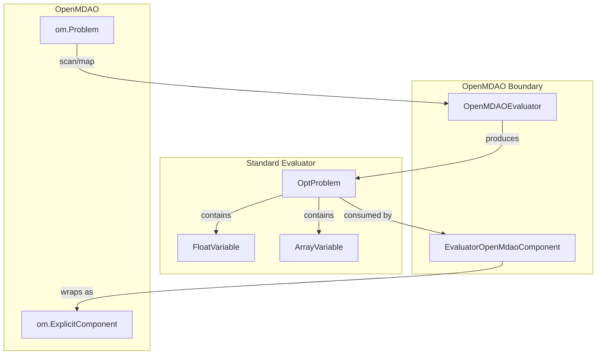

# Design Document: Array Variable Support

## Overview

This design extends the `OpenMDAOEvaluator` and `EvaluatorOpenMdaoComponent` classes to handle `ArrayVariable` instances alongside the existing scalar `FloatVariable` support. Currently, encountering an array-shaped variable (shape != `(1,)`) in an OpenMDAO model raises a `TypeError`. This feature removes that restriction by:

1. Producing `ArrayVariable` instances during model scanning and design-variable mapping.
2. Passing full NumPy arrays through `set_val`/`get_val` during evaluation.
3. Registering shaped inputs/outputs in the OpenMDAO component with correct bounds, scaling, and units.
4. Marshaling array data between the rolled DataFrame representation and OpenMDAO's `inputs`/`outputs` dictionaries.

The changes are backward-compatible: scalar-only models continue to produce identical `FloatVariable` instances and behave exactly as before.

## Architecture

The feature touches two modules that sit at the boundary between the Standard Evaluator library and OpenMDAO:



**Key design decisions:**

1. **Type dispatch over shape inspection**: Both `_expand_info_to_variable` and `_map_elements` branch on shape/size to decide whether to produce `FloatVariable` or `ArrayVariable`. Downstream code uses `isinstance(var, ArrayVariable)` checks for type-specific behavior.

2. **Rolled DataFrame convention preserved**: Array data flows through the system in "rolled" form — each DataFrame cell contains the full NumPy array. This matches the existing convention used by other evaluators (e.g., `ExecutableEvaluator`).

3. **OpenMDAO scaling convention**: OpenMDAO uses `ref0`/`ref` for scaling, not `shift`/`scale` directly. The conversion formulas are: `ref0 = -shift` and `ref = (1/scale) + ref0`. For arrays, these become element-wise operations.

## Components and Interfaces

### OpenMDAOEvaluator Changes

#### `_expand_info_to_variable(info: dict) -> Union[FloatVariable, ArrayVariable]`

**Current behavior**: Raises `TypeError` if shape != `(1,)`.

**New behavior**:
- If `shape == (1,)`: produce `FloatVariable` with:
  - scalar shift, scale, and default values (unchanged logic)
  - `units` = units string from metadata if present and not None
- If `shape != (1,)`: produce `ArrayVariable` with:
  - `shape` = the detected shape tuple
  - `bounds` = `(-inf, +inf)` (expanded by `ArrayVariable.check_shape` validator)
  - `shift` = adder from `om_utils.determine_adder_scaler(ref0, ref, adder, scaler)`, or 0.0 if no scaling metadata
  - `scale` = scaler from the same utility, or 1.0 if no scaling metadata
  - `default` = full `val` array if present, else `np.zeros(shape)`
  - `units` = units string from metadata if present and not None

#### `_map_elements(info: dict) -> list[Union[FloatVariable, ArrayVariable]]`

**Current behavior**: Always produces `FloatVariable`.

**New behavior**:
- Check `size` in each element's metadata (OpenMDAO provides this for design vars/responses).
- If `size > 1`: produce `ArrayVariable` with `shape`, `bounds` (lower/upper from metadata), `scale` (scaler), `shift` (adder), and `units` from metadata `units` field when not None.
- If `size == 1` or `size` absent: produce `FloatVariable` with bounds from metadata, and `units` from metadata `units` field when not None.
- Missing bounds default independently: lower → `-inf`, upper → `+inf`.

#### `_evaluate(sites: pd.DataFrame)`

**Current behavior**: Passes scalars to `set_val` and reads scalars from `get_val`.

**New behavior**:
- For each input variable, check the `opt_problem.variables` list to determine type.
- If `ArrayVariable`: call `self.om_problem.set_val(name, array_value)` where `array_value` is the NumPy array from the DataFrame cell.
- If `FloatVariable`: call `self.om_problem.set_val(name, scalar_value)` (unchanged).
- For each output:
  - If `ArrayVariable`: store full `get_val` result (NumPy array) in the DataFrame cell.
  - If `FloatVariable`: store scalar from `get_val` (unchanged).

### EvaluatorOpenMdaoComponent Changes

#### `setup()`

**Input registration**:
- If variable is `ArrayVariable`:
  - Compute `val`: use `var.default` if not None, else compute element-wise midpoint of bounds.
  - Call `add_input(name, shape=var.shape, val=val)`.
  - Pass `units=var.units` if units is not None.
- If variable is `FloatVariable`:
  - Compute `val`: use `var.default` if not None, else compute midpoint of bounds (unchanged).
  - Call `add_input(name, val=val)`.
  - Pass `units=var.units` if units is not None; omit the `units` keyword argument if units is None.

**Output registration**:
- If response is `ArrayVariable`:
  - `val` = `np.zeros(shape)`.
  - Compute `lower`/`upper`: if all elements are the same, pass scalar; if mixed, pass array; if all-inf, omit.
  - Compute `ref0`/`ref` from shift/scale arrays if non-default; omit if default scaling.
  - Raise `ValueError` if any scale element is 0.
  - Pass `units` if not None.
  - Call `add_output(name, shape=shape, val=val, ...)`.
- If response is `FloatVariable`:
  - Compute bounds/scaling as before (unchanged logic).
  - Pass `units=resp.units` if units is not None; omit the `units` keyword argument if units is None.
  - Call `add_output(name, lower=lower, upper=upper, ref0=ref0, ref=ref, val=0.0, ...)`.

#### `compute(inputs, outputs)`

**Input marshaling**:
- For `ArrayVariable` inputs: place `inputs[name]` (NumPy array) directly into the DataFrame cell.
- For `FloatVariable` inputs: place `inputs[name]` as scalar (unchanged).

**Output extraction**:
- For `ArrayVariable` outputs: assign DataFrame cell (NumPy array) to `outputs[name]`.
- For `FloatVariable` outputs: assign scalar from DataFrame to `outputs[name]` (unchanged).

## Data Models

No new data models are introduced. The existing `ArrayVariable` and `FloatVariable` classes in `problem.py` are used as-is.

**Key type relationships:**

```python
# Existing types (unchanged)
class FloatVariable(BaseModel):
    name: str
    default: Optional[float]
    bounds: Optional[Tuple[float, float]]
    shift: Optional[float]
    scale: Optional[float]
    units: Optional[str]
    class_type: Literal["float"]

class ArrayVariable(FloatVariable):
    shape: Optional[Tuple[int, ...]]
    default: Optional[NDArray]
    bounds: Optional[Tuple[Union[float, NDArray], Union[float, NDArray]]]
    shift: Optional[Union[float, NDArray]]
    scale: Optional[Union[float, NDArray]]
    class_type: Literal["floatarray"]
```

**DataFrame representation (rolled):**

| Row | scalar_var (FloatVariable) | array_var (ArrayVariable, shape=(3,)) |
|-----|---------------------------|---------------------------------------|
| 0   | 2.5                       | np.array([1.0, 2.0, 3.0])           |
| 1   | 3.1                       | np.array([4.0, 5.0, 6.0])           |

**OpenMDAO metadata dictionaries:**

From `get_design_vars()` / `get_responses()`:
```python
{
    "var_name": {
        "size": 3,          # > 1 triggers ArrayVariable
        "shape": (3,),
        "lower": np.array([-1, -1, -1]),
        "upper": np.array([10, 10, 10]),
        "scaler": 2.0,      # or array
        "adder": 0.5,        # or array
    }
}
```

From `list_inputs()` / `list_outputs()`:
```python
{
    "prom_name": "x",
    "shape": (3,),         # != (1,) triggers ArrayVariable
    "val": np.array([1.0, 2.0, 3.0]),
    "ref": 1.0,
    "ref0": 0.0,
    "adder": None,
    "scaler": None,
    "units": "m",
}
```

## Correctness Properties

*A property is a characteristic or behavior that should hold true across all valid executions of a system — essentially, a formal statement about what the system should do. Properties serve as the bridge between human-readable specifications and machine-verifiable correctness guarantees.*

### Property 1: Scan produces ArrayVariable with correct fields for array shapes

*For any* info dictionary with `shape != (1,)` and arbitrary scaling metadata (ref, ref0, adder, scaler), val array, and units string, `_expand_info_to_variable` SHALL produce an `ArrayVariable` whose `shape` matches the input shape, whose `shift` and `scale` equal the output of `om_utils.determine_adder_scaler(ref0, ref, adder, scaler)`, whose `default` equals the `val` array (or `np.zeros(shape)` if val is absent), and whose `units` equals the input units (or None if absent).

**Validates: Requirements 1.1, 1.2, 1.3, 1.4, 1.6, 1.7**

### Property 2: Scan produces FloatVariable with correct fields for scalar shapes

*For any* info dictionary with `shape == (1,)` and arbitrary scaling metadata (ref, ref0, adder, scaler), val entry, and optional units string, `_expand_info_to_variable` SHALL produce a `FloatVariable` (not `ArrayVariable`) with scalar shift, scale, and default values, and whose `units` equals the input units string (or None if absent or None).

**Validates: Requirements 1.5, 7.3**

### Property 3: Map produces ArrayVariable for size > 1

*For any* design-variable or response metadata dictionary with `size > 1` and an optional `units` field, `_map_elements` SHALL produce an `ArrayVariable` whose `shape` matches the metadata `shape`, whose bounds match the metadata `lower`/`upper` (defaulting independently to -inf/+inf when absent), whose `scale` matches the metadata `scaler`, whose `shift` matches the metadata `adder`, and whose `units` equals the metadata units string when not None (or None when absent/None).

**Validates: Requirements 2.1, 2.2, 2.4, 2.5**

### Property 4: Map produces FloatVariable for size ≤ 1

*For any* design-variable or response metadata dictionary with `size == 1` or `size` absent and an optional `units` field, `_map_elements` SHALL produce a `FloatVariable` with bounds from metadata (defaulting to [-inf, +inf] when absent) and `units` set to the metadata units string when not None (or None when absent/None).

**Validates: Requirements 2.3, 2.5**

### Property 5: Evaluate correctly passes and extracts mixed scalar/array data

*For any* `OptProblem` containing a mix of `FloatVariable` and `ArrayVariable` inputs and outputs, and *for any* DataFrame of valid sites, `_evaluate` SHALL call `set_val` with the full NumPy array for `ArrayVariable` inputs (preserving shape) and with scalar values for `FloatVariable` inputs, and SHALL store the full NumPy array from `get_val` in the DataFrame cell for `ArrayVariable` outputs and scalar values for `FloatVariable` outputs.

**Validates: Requirements 3.1, 3.2, 3.3, 3.4, 3.5**

### Property 6: Component setup registers inputs correctly with units

*For any* variable (either `ArrayVariable` or `FloatVariable`) in an OptProblem's variables list, the component's `setup` SHALL call `add_input` with the appropriate shape and val, and SHALL pass `units` to `add_input` only when the variable's units is not None.

**Validates: Requirements 4.1, 4.2, 4.3, 4.5, 4.6, 4.7**

### Property 7: Component setup registers outputs correctly with units

*For any* response (either `ArrayVariable` or `FloatVariable`) in an OptProblem's responses list with no zero scale elements, the component's `setup` SHALL call `add_output` with the appropriate shape, val, bounds, and scaling, and SHALL pass `units` to `add_output` only when the response's units is not None.

**Validates: Requirements 5.1, 5.2, 5.3, 5.4, 5.5**

### Property 8: Component compute marshals mixed scalar/array data correctly

*For any* OptProblem containing a mix of `FloatVariable` and `ArrayVariable` variables and responses, the component's `compute` SHALL place full NumPy arrays from `inputs[name]` into the DataFrame for `ArrayVariable` inputs and scalars for `FloatVariable` inputs, and SHALL extract full NumPy arrays from the DataFrame to `outputs[name]` for `ArrayVariable` responses and scalars for `FloatVariable` responses.

**Validates: Requirements 6.1, 6.2, 6.3, 6.4**

### Property 9: Scaling conversion round-trip

*For any* non-zero scale array and shift array, converting from (shift, scale) to (ref0, ref) via `ref0 = -shift; ref = (1/scale) + ref0` and back via `shift = -ref0; scale = 1/(ref - ref0)` SHALL produce the original shift and scale values (within floating-point tolerance).

**Validates: Requirements 5.5**

## Error Handling

| Condition | Behavior | Location |
|-----------|----------|----------|
| `ArrayVariable` output with any scale element == 0 | Raise `ValueError` with message indicating zero scale causes division-by-zero in OpenMDAO normalization | `EvaluatorOpenMdaoComponent.setup()` |
| Shape `(1,)` input/output | Produce `FloatVariable` (unchanged behavior) | `_expand_info_to_variable` |
| Missing `val` in array-shaped metadata | Default to `np.zeros(shape)` | `_expand_info_to_variable` |
| Missing `lower`/`upper` in metadata | Default independently to `-inf`/`+inf` | `_map_elements` |
| Missing scaling metadata (all None) | Default shift=0.0, scale=1.0 | `_expand_info_to_variable` |
| All bounds infinite for output | Omit `lower`/`upper` kwargs from `add_output` | `EvaluatorOpenMdaoComponent.setup()` |
| Default scaling (shift=0, scale=1) | Omit `ref0`/`ref` from `add_output` | `EvaluatorOpenMdaoComponent.setup()` |

## Testing Strategy

### Property-Based Tests (Hypothesis)

The feature is well-suited for property-based testing because the functions under test are essentially pure transformations of input metadata dictionaries into typed variable objects, and data marshaling with clear input/output contracts. The input space (possible shapes, bounds, scaling values, units) is large.

**Library**: `hypothesis` (already used extensively in this project)

**Configuration**: Minimum 100 iterations per property test (`@settings(max_examples=100)`)

**Property test tagging**: Each test will include a docstring comment:
```python
# Feature: array-variable-support, Property N: <property_text>
```

**Properties to implement as PBT:**
1. Property 1: `_expand_info_to_variable` ArrayVariable production (strategies: random shapes, scaling, val arrays, units)
2. Property 2: `_expand_info_to_variable` FloatVariable production (strategies: scalar info dicts with optional units)
3. Property 3: `_map_elements` ArrayVariable production (strategies: random metadata with size > 1, optional units)
4. Property 4: `_map_elements` FloatVariable production (strategies: random metadata with size == 1, optional units)
5. Property 5: `_evaluate` data flow (strategies: random OptProblems with mixed types, mocked om_problem)
6. Property 6: Component input registration (strategies: random ArrayVariables and FloatVariables with optional units, mocked add_input)
7. Property 7: Component output registration (strategies: random ArrayVariable and FloatVariable responses with optional units, mocked add_output)
8. Property 8: Component compute marshaling (strategies: random mixed OptProblems, mocked evaluator)
9. Property 9: Scaling conversion round-trip (strategies: random non-zero scale/shift arrays)

### Unit Tests (Example-Based)

Unit tests complement the property tests for specific edge cases and integration scenarios:

- **Zero scale raises ValueError**: Verify `setup()` raises for a response with scale containing a zero element.
- **Scalar-only backward compatibility**: End-to-end test with a real scalar OpenMDAO model verifying identical behavior.
- **Mixed model scanning**: Integration test scanning a real OpenMDAO model with both scalar and array variables.
- **No new constructor parameters**: Smoke test verifying constructors accept existing argument signatures.

### Integration Tests

- Full round-trip: Create OpenMDAO model → wrap with `OpenMDAOEvaluator` → wrap with `EvaluatorOpenMdaoComponent` → run in OpenMDAO group → verify outputs match direct model execution.
- Scalar-only round-trip: Same as above with scalar-only model, verifying identical results to pre-feature behavior.
