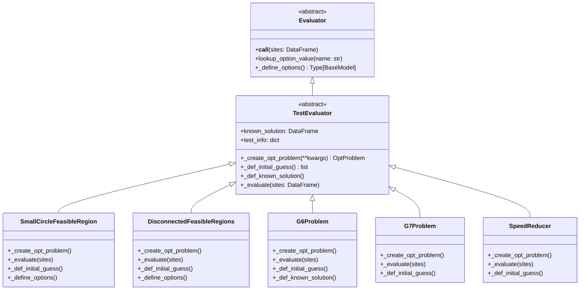

# Design Document: Benchmark Test Problems

## Overview

This feature adds five analytical benchmark test problems to the Standard Evaluator library as concrete `TestEvaluator` subclasses. These evaluators implement well-defined mathematical optimization/feasibility problems used for benchmarking constrained optimization algorithms, particularly feasibility-discovery methods.

The problems form a progression of difficulty:
- **2D feasibility**: SmallCircleFeasibleRegion (1 constraint), DisconnectedFeasibleRegions (1 constraint)
- **2D constrained optimization**: G6Problem (2 constraints + 1 objective)
- **10D constrained optimization**: G7Problem (8 constraints + 1 objective)
- **7D engineering design**: SpeedReducer (11 constraints + 1 objective)

Each evaluator follows the established patterns in the codebase (see `constrained_betts.py`, `cosine_tensor_product.py`) and integrates seamlessly with the auto-discovery mechanism in `__init__.py`.

## Architecture



### File Layout

```
src/standard_evaluator/evaluators/test/
├── __init__.py                          # Update _EXPECTED_COUNT from 38 → 43
├── small_circle_feasible_region.py      # SmallCircleFeasibleRegion + Options
├── disconnected_feasible_regions.py     # DisconnectedFeasibleRegions + Options
├── g6_problem.py                        # G6Problem
├── g7_problem.py                        # G7Problem
└── speed_reducer.py                     # SpeedReducer

tests/evaluators/test/
├── test_small_circle_feasible_region.py
├── test_disconnected_feasible_regions.py
├── test_g6_problem.py
├── test_g7_problem.py
└── test_speed_reducer.py
```

## Components and Interfaces

### SmallCircleFeasibleRegion

A feasibility-only evaluator with a single circular constraint. Points inside the circle (centered at `(a, b)` with radius `r`) are feasible.

**Options Model**: `SmallCircleFeasibleRegionOptions`
| Field | Type  | Default |
|-------|-------|---------|
| a     | float | 0.5     |
| b     | float | -0.3    |
| r     | float | 0.15    |

**OptProblem Configuration**:
- Variables: `x1 ∈ [-1, 1]`, `x2 ∈ [-1, 1]`
- Responses: `g1` with bounds `(-inf, 0]`
- Objectives: `[]`
- Constraints: `["g1"]`
- Initial guess: `[0.0, 0.0]`

**Evaluation**: `g1 = (x1 − a)² + (x2 − b)² − r²`

### DisconnectedFeasibleRegions

A feasibility-only evaluator with multiple circular feasible islands. Supports both a nonsmooth (exact min) and smooth (soft-min via log-sum-exp) formulation.

**Options Model**: `DisconnectedFeasibleRegionsOptions`
| Field   | Type                        | Default                                  |
|---------|-----------------------------|------------------------------------------|
| centers | list of (float, float)      | [(-0.5,-0.4), (0.4,0.3), (-0.2,0.6)]    |
| radii   | list of float               | [0.15, 0.12, 0.10]                       |
| smooth  | bool                        | False                                    |
| tau     | float (must be > 0)         | 0.01                                     |

**Pydantic Validator**: Ensure `len(centers) == len(radii)`.

**OptProblem Configuration**:
- Variables: `x1 ∈ [-1, 1]`, `x2 ∈ [-1, 1]`
- Responses: `g1` with bounds `(-inf, 0]`
- Objectives: `[]`
- Constraints: `["g1"]`
- Initial guess: `[0.0, 0.0]`

**Evaluation (smooth=False)**:
```
d_ℓ = (x1 − a_ℓ)² + (x2 − b_ℓ)² − r_ℓ²
g1 = min(d_ℓ for all ℓ)
```

**Evaluation (smooth=True)**:
```
d_ℓ = (x1 − a_ℓ)² + (x2 − b_ℓ)² − r_ℓ²
g1 = −τ · log(Σ_ℓ exp(−d_ℓ / τ))
```

**Numerical stability note**: The smooth formulation uses the log-sum-exp trick — subtract `max(-d_ℓ/τ)` before exponentiation — to prevent overflow.

### G6Problem

A 2D constrained optimization benchmark from the literature with a narrow crescent-shaped feasible region.

**OptProblem Configuration**:
- Variables: `x1 ∈ [13, 100]`, `x2 ∈ [0, 100]`
- Responses: `f` bounds `(-inf, inf)`, `g1` bounds `(-inf, 0]`, `g2` bounds `(-inf, 0]`
- Objectives: `["f"]`
- Constraints: `["g1", "g2"]`
- Initial guess: `[20.0, 5.5]` (feasible starting point)
- Known solution: `x1 = 14.095, x2 = 0.84296`, `f ≈ −6961.81388`

**Evaluation**:
```
f  = (x1 − 10)³ + (x2 − 20)³
g1 = −(x1 − 5)² − (x2 − 5)² + 100
g2 = (x1 − 6)² + (x2 − 5)² − 82.81
```

**Citation**: Floudas, C.A. and Pardalos, P.M., "A Collection of Test Problems for Constrained Global Optimization Algorithms", Springer-Verlag, 1990.

### G7Problem

A 10D constrained optimization benchmark with 8 nonlinear inequality constraints.

**OptProblem Configuration**:
- Variables: `x1` through `x10`, each bounded `[-10, 10]`
- Responses: `f` bounds `(-inf, inf)`, `g1`–`g8` each bounds `(-inf, 0]`
- Objectives: `["f"]`
- Constraints: `["g1", ..., "g8"]`
- Initial guess: `[0.0] * 10`

**Evaluation**:
```
f = x1² + x2² + x1·x2 − 14·x1 − 16·x2 + (x3−10)² + 4·(x4−5)²
    + (x5−3)² + 2·(x6−1)² + 5·x7² + 7·(x8−11)² + 2·(x9−10)²
    + (x10−7)² + 45

g1 = −105 + 4·x1 + 5·x2 − 3·x7 + 9·x8
g2 = 10·x1 − 8·x2 − 17·x7 + 2·x8
g3 = −8·x1 + 2·x2 + 5·x9 − 2·x10 − 12
g4 = 3·(x1−2)² + 4·(x2−3)² + 2·x3² − 7·x4 − 120
g5 = 5·x1² + 8·x2 + (x3−6)² − 2·x4 − 40
g6 = x1² + 2·(x2−2)² − 2·x1·x2 + 14·x5 − 6·x6
g7 = 0.5·(x1−8)² + 2·(x2−4)² + 3·x5² − x6 − 30
g8 = −3·x1 + 6·x2 + 12·(x9−8)² − 7·x10
```

**Citation**: Hock, W. and Schittkowski, K., "Test Examples for Nonlinear Programming Codes", Springer-Verlag, 1981.

### SpeedReducer

A 7D engineering design problem minimizing the weight of a speed reducer (gear box) subject to 11 constraints on stress, deflection, and geometry.

**OptProblem Configuration**:
- Variables and bounds:
  | Var | Description         | Lower | Upper |
  |-----|---------------------|-------|-------|
  | x1  | Face width          | 2.6   | 3.6   |
  | x2  | Module of teeth     | 0.7   | 0.8   |
  | x3  | Number of teeth     | 17    | 28    |
  | x4  | Length of shaft 1   | 7.3   | 8.3   |
  | x5  | Length of shaft 2   | 7.8   | 8.3   |
  | x6  | Diameter of shaft 1 | 2.9   | 3.9   |
  | x7  | Diameter of shaft 2 | 5.0   | 5.5   |

- Responses: `f` bounds `(-inf, inf)`, `g1`–`g11` each bounds `(-inf, 0]`
- Objectives: `["f"]`
- Constraints: `["g1", ..., "g11"]`
- Initial guess: midpoints of variable bounds

**Evaluation** (objective):
```
f = 0.7854·x1·x2²·(3.3333·x3² + 14.9334·x3 − 43.0934)
    − 1.508·x1·(x6² + x7²)
    + 7.4777·(x6³ + x7³)
    + 0.7854·(x4·x6² + x5·x7²)
```

**Evaluation** (constraints):
```
g1  = 27 / (x1·x2²·x3) − 1
g2  = 397.5 / (x1·x2²·x3²) − 1
g3  = 1.93·x4³ / (x2·x3·x6⁴) − 1
g4  = 1.93·x5³ / (x2·x3·x7⁴) − 1
g5  = sqrt((745·x4 / (x2·x3))² + 16.9e6) / (110·x6³) − 1
g6  = sqrt((745·x5 / (x2·x3))² + 157.5e6) / (85·x7³) − 1
g7  = x2·x3 / 40 − 1
g8  = 5·x2 / x1 − 1
g9  = x1 / (12·x2) − 1
g10 = (1.5·x6 + 1.9) / x4 − 1
g11 = (1.1·x7 + 1.9) / x5 − 1
```

**Citation**: Golinski, J., "An Adaptive Optimization System Applied to Machine Synthesis", Mechanism and Machine Theory, 8(4), pp. 419–436, 1973.

## Data Models

### OptProblem Configuration Pattern

Each evaluator constructs its `OptProblem` via the same pattern used throughout the codebase:

```python
new_prob = se.utilities.create_opt_problem(
    num_independent=N_VARS,
    num_dependent=N_RESPONSES,
    name="problem_name"
)
```

Then configures:
1. **Variables**: Set `name`, `bounds`, `default` for each variable
2. **Responses**: Set `name`, `bounds` for each response
3. **Objectives/Constraints**: Assign lists of response names
4. **Metadata**: Set `description` and `cite`

### Options Pattern

Evaluators with configurable parameters follow the established pattern:

```python
class FooOptions(BaseModel):
    """Pydantic model defining options."""
    param: float = 1.0

class Foo(TestEvaluator):
    @classmethod
    def _define_options(cls) -> Type[BaseModel]:
        return FooOptions

    def _evaluate(self, sites: pd.DataFrame) -> None:
        val = self.lookup_option_value("param")
        # use val in computation
```

### Shared Conventions

- Variable names use 1-based indexing: `x1`, `x2`, ..., `xN`
- Constraint response bounds are `(-inf, 0]` for inequality `g ≤ 0`
- Objective response bounds are `(-inf, inf)`
- `_def_initial_guess()` returns a list of floats
- `_def_known_solution()` returns `pd.Series` with variable values, or `None`

## Correctness Properties

*A property is a characteristic or behavior that should hold true across all valid executions of a system — essentially, a formal statement about what the system should do. Properties serve as the bridge between human-readable specifications and machine-verifiable correctness guarantees.*

### Property 1: SmallCircleFeasibleRegion formula correctness

*For any* pair (x1, x2) and any valid option values (a, b, r), evaluating SmallCircleFeasibleRegion SHALL produce g1 equal to (x1−a)² + (x2−b)² − r², within floating-point tolerance.

**Validates: Requirements 1.6**

### Property 2: DisconnectedFeasibleRegions nonsmooth formula correctness

*For any* pair (x1, x2) and any valid island configuration (centers, radii) with smooth=False, evaluating DisconnectedFeasibleRegions SHALL produce g1 equal to the minimum over all islands ℓ of [(x1−a_ℓ)² + (x2−b_ℓ)² − r_ℓ²], within floating-point tolerance.

**Validates: Requirements 2.6**

### Property 3: DisconnectedFeasibleRegions smooth formula correctness

*For any* pair (x1, x2) and any valid island configuration (centers, radii) with smooth=True and tau > 0, evaluating DisconnectedFeasibleRegions SHALL produce g1 equal to −τ·log(Σ_ℓ exp(−d_ℓ/τ)) where d_ℓ = (x1−a_ℓ)² + (x2−b_ℓ)² − r_ℓ², within floating-point tolerance.

**Validates: Requirements 2.7**

### Property 4: G6Problem all-responses formula correctness

*For any* pair (x1, x2) within [13, 100] × [0, 100], evaluating G6Problem SHALL produce f = (x1−10)³ + (x2−20)³, g1 = −(x1−5)² − (x2−5)² + 100, and g2 = (x1−6)² + (x2−5)² − 82.81, all within floating-point tolerance.

**Validates: Requirements 3.4, 3.5, 3.6**

### Property 5: G7Problem all-responses formula correctness

*For any* 10-tuple (x1, ..., x10) within [-10, 10]¹⁰, evaluating G7Problem SHALL produce the objective f and constraints g1–g8 exactly as defined by the G7 formulas, within floating-point tolerance.

**Validates: Requirements 4.4, 4.5**

### Property 6: SpeedReducer all-responses formula correctness

*For any* 7-tuple (x1, ..., x7) within the defined variable bounds, evaluating SpeedReducer SHALL produce the objective f and constraints g1–g11 exactly as defined by the speed reducer formulas, within floating-point tolerance.

**Validates: Requirements 5.4, 5.5**

### Property 7: All evaluators produce finite responses for any input

*For any* of the 5 new evaluators and *for any* input sites (within or outside defined variable bounds), calling the evaluator SHALL not raise an exception and SHALL produce response values that are finite real numbers (not NaN) for all responses.

**Validates: Requirements 6.3, 6.4**

## Error Handling

### Division by Zero (SpeedReducer)

The SpeedReducer constraints g1–g9 involve divisions by products of variables. When variables are at their defined lower bounds (e.g., `x2 = 0.7`, `x3 = 17`), denominators are safely non-zero. However, since bounds enforcement is the caller's responsibility (Requirement 6.4), the evaluator must handle inputs at zero gracefully:

- **Design decision**: The evaluator does NOT guard against division by zero. NumPy naturally produces `inf` or `nan` for such cases, which satisfies the "no exception" requirement. The property tests (Property 7) verify that within the defined bounds, outputs are finite. Out-of-bounds inputs may produce non-finite values but must not raise exceptions.

### Log-Sum-Exp Overflow (DisconnectedFeasibleRegions)

When `smooth=True` and `tau` is very small (e.g., 0.001), the `exp(-d_ℓ/τ)` terms can overflow. The implementation uses the standard log-sum-exp numerical stability trick:

```python
shifted = -d / tau
max_val = np.max(shifted, axis=...)
g1 = -tau * (max_val + np.log(np.sum(np.exp(shifted - max_val), axis=...)))
```

### Pydantic Validation (DisconnectedFeasibleRegions)

The options model validates that `centers` and `radii` have matching lengths and that `tau > 0`. Invalid configurations raise `ValidationError` at construction time, before any evaluation occurs.

## Testing Strategy

### Property-Based Tests

Property-based testing is appropriate for this feature because:
- Each evaluator implements pure mathematical functions with clear input/output behavior
- Universal properties (formula correctness) should hold across the entire input space
- The input space is large (continuous real-valued variables)
- Random inputs reveal coefficient errors, sign mistakes, and numerical issues

**Library**: [Hypothesis](https://hypothesis.readthedocs.io/) (already a test dependency)

**Configuration**:
- Minimum 100 examples per property test (use `@settings(max_examples=100)`)
- Each test tagged with a comment referencing the design property

**Tag format**: `# Feature: benchmark-test-problems, Property {N}: {title}`

**Implementation approach for formula properties (Properties 1–6)**:
- Generate random input values within variable bounds using `st.floats(min_value=lo, max_value=hi)`
- Construct a DataFrame, call the evaluator
- Independently compute expected values using plain Python/NumPy (a separate, simple implementation)
- Assert evaluator output matches expected values within `1e-10` relative tolerance

**Implementation approach for Property 7 (finite responses)**:
- Use `@pytest.mark.parametrize` over all 5 evaluator classes
- Generate random inputs both within and outside bounds
- Assert no exception is raised and all outputs are finite (within bounds) or at least no exception (outside bounds)

### Unit Tests (Example-Based)

Each evaluator gets a dedicated test module with:

1. **Instantiation test**: Verify `isinstance(evaluator, TestEvaluator)` and `test_info` is populated
2. **Problem structure test**: Verify variable names, bounds, response names, response bounds, objectives, constraints
3. **Feasible point test**: Evaluate at a known feasible point, assert all `g_j ≤ 0`
4. **Infeasible point test**: Evaluate at a known infeasible point, assert at least one `g_j > 0`
5. **Known solution test** (where applicable): Verify `known_solution` property returns correct values
6. **Options test** (SmallCircleFeasibleRegion, DisconnectedFeasibleRegions): Verify `_define_options`, `lookup_option_value`, custom options

### Test Data (Analytically Derived)

| Evaluator | Feasible Point | Infeasible Point |
|-----------|---------------|------------------|
| SmallCircleFeasibleRegion | (0.5, -0.3) — center | (0.0, 0.0) — origin |
| DisconnectedFeasibleRegions | (-0.5, -0.4) — first island center | (0.0, 0.0) — between islands |
| G6Problem | (14.095, 0.84296) — known optimum | (20.0, 50.0) |
| G7Problem | Known feasible from literature | (0.0, ..., 0.0) |
| SpeedReducer | (3.5, 0.7, 17, 7.3, 7.8, 3.35, 5.287) | Bounds midpoints (verify) |

### Dual Testing Rationale

- **Property tests** verify that formulas are universally correct across the input space (catch coefficient/sign transcription errors)
- **Unit tests** verify specific known points, problem structure, and integration (catch configuration errors)
- Together they provide comprehensive coverage: properties ensure mathematical correctness, examples ensure integration correctness
