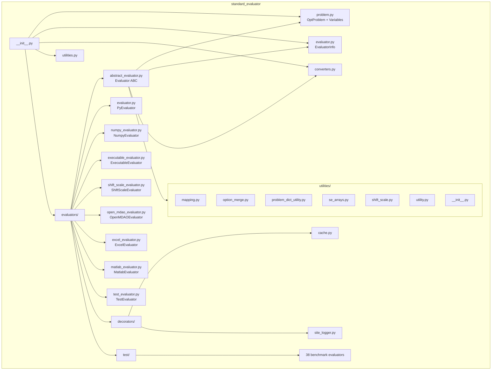

# Design Document: Evaluator Migration

## Overview

This design describes the migration of evaluator classes from `boeing_standard_evaluator` into `standard_evaluator`, making the target library independently functional. The migration copies the evaluator hierarchy (abstract base, concrete evaluators, decorators, test evaluators) and supporting utilities while updating all import paths. The existing `standard_evaluator` classes (`StandardBase`, `StandardEval`, `StandardGroup`, `EvaluatorInfo`, `OptProblem`) remain unchanged except for new methods added to `OptProblem` (Requirement 17).

### Key Design Decisions

1. **Copy, don't move**: Source files are duplicated into the target. The source library retains its copies for backward compatibility.
2. **Import path rewriting**: All `boeing_standard_evaluator` references become `standard_evaluator` equivalents. The migrated `abstract_evaluator.py` already imports `standard_evaluator as se`; post-migration it will use only `standard_evaluator` paths.
3. **Utilities colocated in a new `utilities/` subpackage**: The target library gains `src/standard_evaluator/utilities/` containing the subset of utility modules required by the evaluators.
4. **Optional imports preserved**: `MatlabEvaluator` keeps its try/except pattern; `evaluators/__init__.py` exposes a `can_use_matlab` flag.
5. **Auto-discovery for test evaluators**: The `evaluators/test/__init__.py` uses `importlib` + `inspect` to discover all test evaluator classes, identical to the source pattern.
6. **OptProblem extension via model_validator**: `build_maps` and `_setup_partials` are called in a new `model_validator(mode="after")` that chains after the existing `check_problem` validator.

## Architecture



### Dependency Flow

The evaluator classes depend on:
- `standard_evaluator.problem` → `OptProblem`, `Variable` types, `ArrayVariable`
- `standard_evaluator.evaluator` → `EvaluatorInfo`
- `standard_evaluator.converters` → `evaluator_info_to_opt_problem`, `opt_problem_to_evaluator_info`
- `standard_evaluator.utilities` (new subpackage) → array utilities, shift/scale, mapping, problem dict helpers

## Components and Interfaces

### 1. `evaluators/` Package (`src/standard_evaluator/evaluators/__init__.py`)

**Responsibilities**: Re-export all evaluator classes; handle optional MatlabEvaluator import.

**Exports** (via `__all__`):
- `Evaluator`, `PyEvaluator`, `NumpyEvaluator`, `ExecutableEvaluator`, `ShiftScaleEvaluator`
- `OpenMDAOEvaluator`, `ExcelEvaluator`, `TestEvaluator`
- `SpreadsheetModel`, `MacroDefinition`, `VarType`, `get_interface_from_excel_named_ranges`, `create_variable_from_excel_address`
- `MatlabEvaluator` (conditional)
- All test evaluator classes via `test.__all__`

**Module-level flags**:
- `can_use_matlab: bool` — True if `matlab.engine` is importable

### 2. `Evaluator` ABC (`evaluators/abstract_evaluator.py`)

**Public Interface** (unchanged from source):
- `__call__(sites: pd.DataFrame, **kwargs) -> None`
- `eval_np(sites: np.ndarray, names=None, **kwargs) -> np.ndarray`
- `eval_list(sites: List, names=None, **kwargs) -> List`
- `default_site() -> pd.DataFrame`
- `initial_guess() -> pd.DataFrame`
- Properties: `problem`, `opt_problem`, `interface`, `variables`, `responses`, `inputs`, `outputs`, `nind`, `ndep`, `name`, `comp_cost`
- Abstract method: `_evaluate(sites: pd.DataFrame, **kwargs)`
- Internal: `_get_partials_by_central_difference(sites, opt_problem)`, `_compute_signature(sites)`

**Import Changes**:
| Source import | Target import |
|---|---|
| `boeing_standard_evaluator.utilities` | `standard_evaluator.utilities` |
| `boeing_standard_evaluator.evaluators.decorators.cache` | `standard_evaluator.evaluators.decorators.cache` |
| `boeing_standard_evaluator.evaluators.decorators.site_logger` | `standard_evaluator.evaluators.decorators.site_logger` |
| `boeing_standard_evaluator.opt_problem.OptProblem` | `standard_evaluator.problem.OptProblem` |
| `boeing_standard_evaluator.conversions` | `standard_evaluator.converters` |
| `boeing_standard_evaluator.evaluator_info.EvaluatorInfo` | `standard_evaluator.evaluator.EvaluatorInfo` |
| `boeing_standard_evaluator.utilities.problem_dict_utility` | `standard_evaluator.utilities.problem_dict_utility` |
| `boeing_standard_evaluator.utilities.mapping` | `standard_evaluator.utilities.mapping` |
| `boeing_standard_evaluator.utilities.option_merge` | `standard_evaluator.utilities.option_merge` |

The existing `import standard_evaluator as se` line is retained since it's already correct.

### 3. Concrete Evaluators

Each follows the same migration pattern:
- Copy source file into `src/standard_evaluator/evaluators/`
- Replace all `boeing_standard_evaluator` imports with `standard_evaluator` equivalents
- Inherit from the migrated `Evaluator` base class

| Class | File | Key Dependencies |
|---|---|---|
| `PyEvaluator` | `evaluator.py` | `Evaluator` |
| `NumpyEvaluator` | `numpy_evaluator.py` | `Evaluator`, `se_arrays` utilities |
| `ExecutableEvaluator` | `executable_evaluator.py` | `Evaluator`, `ArrayVariable`, utilities |
| `ShiftScaleEvaluator` | `shift_scale_evaluator.py` | `Evaluator`, `shift_scale`, `problem_dict_utility` |
| `OpenMDAOEvaluator` | `open_mdao_evaluator.py` | `Evaluator`, `EvaluatorInfo`, `OptProblem` |
| `ExcelEvaluator` | `excel_evaluator.py` | `Evaluator`, `excel_utilities` |
| `MatlabEvaluator` | `matlab_evaluator.py` | `Evaluator` (optional `matlab.engine`) |

### 4. `TestEvaluator` Base Class (`evaluators/test_evaluator.py`)

- Inherits from migrated `Evaluator`
- Provides `known_solution` property (returns `pd.DataFrame`)
- Abstract method: `_create_opt_problem()`
- Class attribute `__test__ = False` to prevent pytest discovery

### 5. Decorators (`evaluators/decorators/`)

| Module | Export | Behavior |
|---|---|---|
| `cache.py` | `cacher` | Wraps `_evaluate` with SQLite-backed caching |
| `site_logger.py` | `site_logger` | Wraps `_evaluate` with in-memory logging |

### 6. Test Evaluators (`evaluators/test/`)

- 38 benchmark files (see Requirement 12 for full list)
- Each defines one class inheriting from `TestEvaluator`
- `__init__.py` auto-discovers all classes via `importlib`/`inspect`

### 7. Utilities Package (`src/standard_evaluator/utilities/`)

New package containing migrated utility modules:

| Module | Key Exports |
|---|---|
| `mapping.py` | `flat_element_list`, `flatten_items_to_arrays`, `compress_whitespace`, `res_element_to_string` |
| `option_merge.py` | `combine_instances` |
| `problem_dict_utility.py` | `legacy_to_opt_problem`, `collect_names`, `opt_problem_to_legacy`, `create_opt_problem`, `create_evaluator_info`, `problem_calculate_fields` |
| `se_arrays.py` | `generate_names`, `unroll_data_frame`, `unroll_data_frame_using_variables`, `unroll_data_frame_numpy`, `unroll_names`, `unroll_names_using_variables`, `roll_data_frame`, `roll_data_frame_using_variables`, `get_variable_shape_in_data_frame`, `check_rolled_data_frame_against_variable_shapes` |
| `shift_scale.py` | `ShiftAndScale` |
| `utility.py` | `apply_types`, `apply_types_from_evaluator_info`, `create_df_from_problem`, `create_df_from_evaluator_info`, `check_prob`, `get_types`, `get_types_from_evaluator_info`, `concat_w_empty`, `remove_duplicates`, `get_constant_vars`, `restrict_problem`, `get_shift_scale_value`, `update_bounds_to_optimizer_space`, `update_bounds_to_design_space` |

The `utilities/__init__.py` re-exports all public symbols, mirroring the source library's pattern.

### 8. OptProblem Extension (`problem.py`)

New methods and properties added to the existing `OptProblem` class:

- `build_maps() -> Tuple[pd.DataFrame, pd.DataFrame]`
- `_setup_partials() -> None`
- Read-only properties: `var_map`, `res_map`, `flat_partials_res_indices`, `num_partials_responses`, `grad_cols`, `jac_cols`, `num_objs_total`, `num_cons_total`, `free_flat_var_mask`, `free_flat_var_positions`, `num_flat_vars`, `full_to_free_var_index`
- New `model_validator(mode="after")` named `_init_maps_and_partials` that calls `build_maps` then `_setup_partials`

## Data Models

### Variable Types (existing, unchanged)

```python
Variable = Union[FloatVariable, IntVariable, ArrayVariable, CategoricalVariable]
```

### OptProblem (extended)

```python
class OptProblem(BaseModel):
    # Existing fields
    name: str
    variables: List[Variable]
    responses: List[Variable]
    objectives: List[str]
    constraints: List[str]
    description: Optional[str]
    cite: Optional[str]
    options: Dict

    # New private attributes (populated by model_validator)
    _var_map: pd.DataFrame       # columns: name, multi, flat, fixed, jac_row, grad_row
    _res_map: pd.DataFrame       # columns: name, multi, flat, objective, constraint, grad_col, jac_col
    _flat_partials_res_indices: np.ndarray  # 1-D int
    _num_partials_responses: int
    _grad_cols: np.ndarray       # 1-D int (-1 sentinel)
    _jac_cols: np.ndarray        # 1-D int (-1 sentinel)
    _num_objs_total: int
    _num_cons_total: int
    _free_flat_var_mask: np.ndarray         # 1-D bool
    _free_flat_var_positions: np.ndarray    # 1-D int
    _num_flat_vars: int
    _full_to_free_var_index: np.ndarray    # 1-D int (-1 for fixed)
```

### var_map DataFrame Schema

| Column | Type | Description |
|---|---|---|
| `name` | str | Variable name |
| `multi` | tuple or None | Multi-index for array elements, None for scalars |
| `flat` | int | Flattened index (0-based) |
| `fixed` | bool | True when lower bound == upper bound |
| `jac_row` | int or None | Row index in Jacobian (None if fixed) |
| `grad_row` | int or None | Row index in gradient (None if fixed) |

### res_map DataFrame Schema

| Column | Type | Description |
|---|---|---|
| `name` | str | Response name |
| `multi` | tuple or None | Multi-index for array elements, None for scalars |
| `flat` | int | Flattened index (0-based) |
| `objective` | bool | True if in objectives list |
| `constraint` | bool | True if in constraints list |
| `grad_col` | int or None | Column index in gradient (None if not objective) |
| `jac_col` | int or None | Column index in Jacobian (None if not constraint) |

### EvaluatorInfo (existing, unchanged)

Used by evaluators to describe their interface. Already defined in `standard_evaluator.evaluator`.

### SpreadsheetModel (migrated from excel_utilities.py)

Dataclass/model describing Excel workbook interface definitions for `ExcelEvaluator`.


## Correctness Properties

*A property is a characteristic or behavior that should hold true across all valid executions of a system—essentially, a formal statement about what the system should do. Properties serve as the bridge between human-readable specifications and machine-verifiable correctness guarantees.*

### Property 1: Test evaluator independence and correctness

*For any* of the 38 migrated test evaluators and *for any* valid input DataFrame with values within the evaluator's declared variable bounds, instantiating and calling the evaluator SHALL succeed without `boeing_standard_evaluator` appearing in `sys.modules`, and the output values SHALL match the known analytic formula.

**Validates: Requirements 2.5, 12.5, 13.5, 16.3**

### Property 2: PyEvaluator functional equivalence

*For any* valid Python callable that accepts keyword arguments matching declared variable names and returns a dictionary of response values, and *for any* valid input DataFrame within bounds, the migrated PyEvaluator SHALL produce output values identical to direct invocation of the callable.

**Validates: Requirements 3.4**

### Property 3: Evaluator constructor input validation

*For any* value that is not callable and is not None, passing it as the `func` argument to PyEvaluator SHALL raise a `TypeError`. Similarly, *for any* object that is not an instance of `Evaluator`, passing it as the `evaluate` argument to `ShiftScaleEvaluator` SHALL raise a `TypeError`.

**Validates: Requirements 3.5, 6.5**

### Property 4: NumpyEvaluator numerical equivalence

*For any* concrete subclass of NumpyEvaluator (drawn from the 38 test evaluators that use NumPy operations) and *for any* valid input array with values within the evaluator's declared bounds, the migrated evaluator SHALL produce outputs numerically identical (within tolerance 1e-12) to direct computation of the analytic function.

**Validates: Requirements 4.5**

### Property 5: ShiftScaleEvaluator transform equivalence

*For any* valid inner evaluator with known analytic outputs, and *for any* shift/scale parameter set (with non-zero scales), and *for any* input DataFrame with values within the shifted/scaled bounds, the migrated ShiftScaleEvaluator SHALL produce outputs matching manual application of the inverse shift/scale transform followed by inner evaluation followed by response shift/scale, within a tolerance of 1e-10.

**Validates: Requirements 6.4**

### Property 6: ShiftScaleEvaluator Jacobian consistency

*For any* evaluator that provides an analytic Jacobian and *for any* valid shift/scale parameters and *for any* input point within bounds, the ShiftScaleEvaluator's adjusted Jacobian SHALL agree with the central finite-difference approximation of the shifted/scaled function within a tolerance of 1e-4.

**Validates: Requirements 6.7**

### Property 7: Source code independence from Boeing references

*For any* Python file under `src/standard_evaluator/`, the file content SHALL contain zero occurrences of `boeing_standard_evaluator` as an import path or module reference, and zero occurrences of Boeing proprietary notice text ("Boeing Proprietary", "Boeing Confidential", "All Rights Reserved by Boeing").

**Validates: Requirements 16.3, 16.4**

### Property 8: build_maps structural correctness

*For any* valid OptProblem with N variables (yielding F flattened elements after array expansion) and M responses (yielding R flattened elements), `build_maps()` SHALL return a `var_map` DataFrame with exactly F rows and columns (`name`, `multi`, `flat`, `fixed`, `jac_row`, `grad_row`), and a `res_map` DataFrame with exactly R rows and columns (`name`, `multi`, `flat`, `objective`, `constraint`, `grad_col`, `jac_col`).

**Validates: Requirements 17.1**

### Property 9: Fixed variable exclusion in var_map

*For any* OptProblem containing variables where the lower bound equals the upper bound, the corresponding rows in `var_map` SHALL have `fixed=True` and `jac_row=None` and `grad_row=None`, and those elements SHALL NOT appear in `free_flat_var_positions`.

**Validates: Requirements 17.7**

### Property 10: OptProblem maps initialized after construction

*For any* valid OptProblem configuration, immediately after construction the `var_map` and `res_map` properties SHALL be non-None DataFrames, and the `_setup_partials` attributes (`flat_partials_res_indices`, `num_partials_responses`, `free_flat_var_mask`, `free_flat_var_positions`, `num_flat_vars`) SHALL be populated with values of correct type and consistent dimensions.

**Validates: Requirements 17.2, 17.4**

### Property 11: OptProblem backward compatibility

*For any* valid OptProblem configuration that was valid prior to this migration, the methods `variable_names()`, `response_names()`, `calculate_default()`, `set_defaults()`, and `unroll_names()` SHALL continue to produce identical results, and the `check_problem` model_validator SHALL still execute and raise `ValueError` for invalid objective/constraint references.

**Validates: Requirements 17.8**

## Error Handling

### Import Errors

| Scenario | Behavior |
|---|---|
| `matlab.engine` not installed | `evaluators/__init__.py` catches `ImportError`/`Exception`, sets `can_use_matlab = False`, skips `MatlabEvaluator` |
| Missing transitive utility dependency | Hard `ImportError` at import time (fail-fast per Req 8.5) |
| Test evaluator module fails to load | Auto-discovery in `test/__init__.py` will raise `ImportError` per Req 12.6 |

### Runtime Errors

| Scenario | Exception | Message |
|---|---|---|
| `PyEvaluator(func=non_callable)` | `TypeError` | Indicates func must be callable |
| `ShiftScaleEvaluator(evaluate=non_evaluator)` | `TypeError` | Indicates evaluate must be Evaluator instance |
| `ShiftScaleEvaluator()` with no interface args | `ValueError` | Indicates opt_problem, interface, or problem required |
| `OpenMDAOEvaluator(scan_model=False, use_defined_problem=False)` | `ValueError` | Both flags cannot be False |
| `OptProblem.build_maps()` failure | `ValueError` | Includes problem name and underlying error |
| `OptProblem._setup_partials()` failure | `ValueError` | Includes problem name and underlying error |
| `Evaluator.__call__(non_dataframe)` | `TypeError` | Sites must be a DataFrame |
| `Evaluator.__call__(df_missing_columns)` | `ValueError` | Lists missing columns |

### Backward Compatibility Guards

- The `OptProblem` model_validator chain: existing `check_problem` runs first (validates objectives/constraints), then the new `_init_maps_and_partials` runs.
- If `build_maps` or `_setup_partials` fail, the error is wrapped in a `ValueError` with context, not silently swallowed.
- Existing `OptProblem` usage without new properties continues to work since private attributes are populated silently during init.

## Testing Strategy

### Unit Tests

Unit tests focus on specific examples and edge cases:

- **Import tests**: Verify each evaluator class is importable from `standard_evaluator.evaluators`
- **Interface conformance**: Verify migrated classes have expected methods/properties
- **Source scan**: Verify no `boeing_standard_evaluator` references remain in source files
- **Error conditions**: Verify TypeError/ValueError for invalid constructor arguments
- **Optional import handling**: Verify `can_use_matlab` flag behavior with mocked `matlab.engine`
- **Auto-discovery**: Verify `test/__init__.py` finds all 38 benchmark evaluators
- **OptProblem extension**: Verify properties return correct types, validators chain correctly

### Property-Based Tests

Property-based tests verify universal properties across generated inputs using **Hypothesis** (Python PBT library).

Each property test runs a minimum of **100 iterations**.

| Property | Generator Strategy |
|---|---|
| Property 1 (test evaluator independence) | Draw from list of 38 evaluator classes × random valid inputs within bounds |
| Property 2 (PyEvaluator equivalence) | Generate random callables (polynomials), random variable counts, random input DataFrames |
| Property 3 (constructor validation) | Generate arbitrary non-callable objects (ints, strings, lists, dicts) |
| Property 4 (NumpyEvaluator equivalence) | Draw from NumpyEvaluator-based test evaluators × random inputs within bounds |
| Property 5 (ShiftScale equivalence) | Generate random shift/scale values × random inputs × polynomial evaluators |
| Property 6 (Jacobian consistency) | Generate evaluators with known Jacobians × random shift/scale × random input points |
| Property 7 (source independence) | Enumerate all .py files under src/standard_evaluator/ (exhaustive, not random) |
| Property 8 (build_maps structure) | Generate random OptProblems with varying variable types (Float, Int, Array, Categorical), response counts, objective/constraint assignments |
| Property 9 (fixed variable exclusion) | Generate OptProblems with random subsets of variables having equal lower/upper bounds |
| Property 10 (maps initialized) | Generate random valid OptProblem configurations |
| Property 11 (backward compat) | Generate OptProblems and verify existing method outputs unchanged |

**Tag format**: `Feature: evaluator-migration, Property {N}: {title}`

### Integration Tests

- Execute `pytest tests/evaluators/` end-to-end in the target project
- Verify `ExecutableEvaluator` with test fixture executables
- Verify `OpenMDAOEvaluator` with real OpenMDAO components
- Verify `ExcelEvaluator` with test spreadsheet fixtures (`Range_example.xlsm`, `test_spreadsheet.xlsm`)

### Test Fixtures to Migrate

From `boeing_standard_evaluator/tests/evaluators/`:
- All `.py` test files (directory structure preserved)
- `Range_example.xlsm`, `test_spreadsheet.xlsm`
- `test_generic_airplane.aom`
- `Executable Evaluator/` directory with contents
