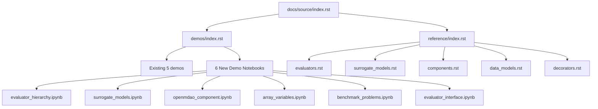
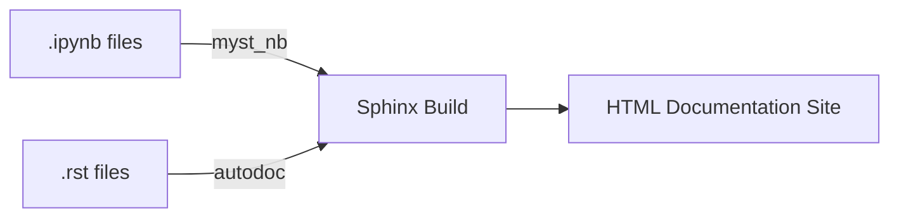

# Design Document: Feature Documentation

## Overview

This design covers the creation of comprehensive tutorial-style Jupyter notebook documentation and API reference pages for the Standard Evaluator library. The documentation will follow the existing MyST-NB Sphinx pattern established in `docs/source/demos/`, producing 6 new demo notebooks and a full API reference section.

The design leverages the existing Sphinx infrastructure (autodoc, autodocsumm, myst_nb, napoleon) already configured in `conf.py`, and the established notebook pattern of alternating markdown/code cells with the `import standard_evaluator as se` convention.

### Key Design Decisions

1. **Notebooks over RST**: Tutorial content is delivered as executable Jupyter notebooks (`.ipynb`) rendered by MyST-NB, matching existing demos. This ensures examples are always runnable.
2. **API Reference via autodoc**: The `reference/` section uses Sphinx `automodule`/`autoclass` directives with `autodocsumm`, generating documentation from source docstrings. No separate hand-written API docs.
3. **Dependency isolation**: Notebooks 1, 3–6 use only base dependencies. Notebook 2 (surrogate models) requires `smt` extras and documents this prominently.
4. **Single demos directory**: All new notebooks go into `docs/source/demos/` alongside existing ones, registered in the existing `demos/index.rst` toctree.

## Architecture

The documentation system is structured as follows:



### Build Flow



MyST-NB executes notebooks during the build (with caching via `jupyter_execute_notebooks = "cache"`) and renders them as HTML pages. The `reference/` RST files use `automodule` and `autoclass` directives to pull docstrings from source code.

## Components and Interfaces

### Demo Notebooks

Each notebook follows the established pattern observed in `defining_options.ipynb`:

| Component | Description |
|-----------|-------------|
| `evaluator_hierarchy.ipynb` | Evaluator class hierarchy, NumpyEvaluator usage, eval_np/eval_list, caching, logging |
| `surrogate_models.ipynb` | SurrogateModel training, prediction, serialization round-trip, SMT models, options |
| `openmdao_component.ipynb` | EvaluatorOpenMdaoComponent wrapping, variable mapping, serialization reconstruction |
| `array_variables.ipynb` | ArrayVariable definition, rolled/unrolled usage, name generation, OpenMDAO integration |
| `benchmark_problems.ipynb` | Benchmark test evaluators by category, evaluation, OptProblem access, known solutions |
| `evaluator_interface.ipynb` | OptProblem vs EvaluatorInfo, variable types, NumpyEvaluator instantiation patterns |

### Notebook Cell Pattern

Every notebook follows this structure:
1. **Cell 1** (markdown): Level-1 heading + overview paragraph
2. **Cell 2** (code): Imports using `import standard_evaluator as se`
3. **Cells 3–N** (alternating): Markdown introducing concept → Code demonstrating it → (optional) Markdown explaining output

No two consecutive code cells without an intervening markdown cell.

### API Reference Section

The `docs/source/reference/` directory contains RST files using Sphinx autodoc:

| File | Content |
|------|---------|
| `index.rst` | Toctree listing all reference sub-pages |
| `evaluators.rst` | `autoclass` directives for Evaluator, NumpyEvaluator, ExecutableEvaluator, ShiftScaleEvaluator, OpenMDAOEvaluator, ExcelEvaluator, MatlabEvaluator |
| `surrogate_models.rst` | `autoclass` directives for SurrogateModel, PolynomialModel, and SMT-based models |
| `components.rst` | `autoclass` directive for EvaluatorOpenMdaoComponent |
| `data_models.rst` | `autoclass` directives for OptProblem, EvaluatorInfo, GroupInfo, FloatVariable, IntVariable, ArrayVariable, CategoricalVariable |
| `decorators.rst` | `automodule` directives for `standard_evaluator.evaluators.decorators.cache` and `standard_evaluator.evaluators.decorators.site_logger` |

### Integration Points

- **demos/index.rst**: Updated to include 6 new toctree entries after existing 5
- **reference/index.rst**: New file referenced from `docs/source/index.rst` (already listed in the main index)
- **conf.py**: No changes required — all needed extensions are already configured

## Data Models

### Notebook Structure (nbformat v4)

Each `.ipynb` file is a JSON document conforming to nbformat v4:

```json
{
  "cells": [
    {
      "cell_type": "markdown" | "code",
      "metadata": {},
      "source": ["line1\n", "line2\n"],
      "outputs": [],          // code cells only
      "execution_count": null // code cells only
    }
  ],
  "metadata": {
    "kernelspec": { "display_name": "Python 3", "language": "python", "name": "python3" },
    "language_info": { "name": "python", "version": "3.11" }
  },
  "nbformat": 4,
  "nbformat_minor": 5
}
```

### RST Reference Page Structure

Each reference RST file follows this pattern:

```rst
Module Title
============

.. automodule:: standard_evaluator.module_path
   :members:
   :show-inheritance:

.. autoclass:: standard_evaluator.module_path.ClassName
   :members:
   :show-inheritance:
   :special-members: __init__, __call__
```

### File Naming Convention

| Notebook | Filename |
|----------|----------|
| Evaluator Hierarchy | `evaluator_hierarchy.ipynb` |
| Surrogate Models | `surrogate_models.ipynb` |
| OpenMDAO Component | `openmdao_component.ipynb` |
| Array Variables | `array_variables.ipynb` |
| Benchmark Problems | `benchmark_problems.ipynb` |
| Evaluator Interface | `evaluator_interface.ipynb` |

## Correctness Properties

*A property is a characteristic or behavior that should hold true across all valid executions of a system — essentially, a formal statement about what the system should do. Properties serve as the bridge between human-readable specifications and machine-verifiable correctness guarantees.*

> **Note on PBT applicability:** This feature primarily produces documentation artifacts (Jupyter notebooks and RST files). Most acceptance criteria concern content presence, structure conformance, and build success — which are best validated with example-based and integration tests. However, the structural invariants of notebooks do lend themselves to universal quantification over the set of all produced notebooks.

### Property 1: Notebook Structure Invariant

*For any* demo notebook produced by this feature, the notebook SHALL begin with a markdown cell containing a level-1 heading, followed by an overview paragraph, and SHALL contain no two consecutive code cells without an intervening markdown cell.

**Validates: Requirements 8.1, 8.2, 8.7**

### Property 2: Build Completeness

*For any* notebook registered in the demos toctree, the Sphinx build SHALL complete with zero warnings and zero errors referencing that notebook file.

**Validates: Requirements 7.3, 9.7**

### Property 3: Notebook Execution Correctness

*For any* demo notebook produced by this feature (given required dependencies are installed), executing all cells sequentially in a fresh kernel SHALL produce zero exceptions.

**Validates: Requirements 1.7, 2.7, 3.5, 4.6, 5.5, 6.6**

## Error Handling

### Notebook Execution Errors

| Error Condition | Handling Strategy |
|----------------|-------------------|
| Missing optional dependency (e.g., `smt`) | Notebook 2 includes a markdown cell before any SMT import stating `pip install standard-evaluator[smt]` is required. Other notebooks use only base dependencies. |
| Import failure | Each notebook uses `import standard_evaluator as se` as the first code cell. If the package is not installed, the ImportError will surface immediately in the first cell. |
| Evaluator runtime error | Code examples use known-good benchmark evaluators with valid input data constructed from `opt_problem.variables` bounds, avoiding invalid inputs. |
| OpenMDAO setup failure | Notebooks 3 and 4 call `prob.setup()` before `prob.run_model()`. Any configuration errors surface at setup time with clear OpenMDAO error messages. |
| Notebook execution timeout | `nb_execution_timeout = 600` in conf.py provides a 10-minute limit per cell. Notebook 2 is designed to complete within 120 seconds total. |

### Sphinx Build Errors

| Error Condition | Handling Strategy |
|----------------|-------------------|
| Missing notebook file in toctree | Sphinx emits a warning identifying the missing file. The toctree entries exactly match the filenames of created notebooks. |
| Broken cross-reference in API docs | All `autoclass` directives reference importable Python paths. Undocumented members use `:undoc-members:` to avoid warnings. |
| Missing docstring warning | The API reference pages use `:members:` which only documents members that have docstrings. Classes without docstrings are excluded from the reference. |

## Testing Strategy

### Approach

Since this feature produces documentation artifacts, the testing strategy focuses on:

1. **Notebook execution tests** — Verify each notebook runs without errors
2. **Structure validation tests** — Verify notebooks follow required patterns
3. **Sphinx build tests** — Verify documentation builds cleanly

### Unit Tests (Example-Based)

These verify specific structural requirements for each notebook:

| Test | Validates |
|------|-----------|
| Each notebook starts with a level-1 markdown heading | Req 8.1 |
| First markdown cell contains an overview paragraph | Req 8.2 |
| No consecutive code cells without intervening markdown | Req 8.7 |
| Import cells use `import standard_evaluator as se` | Req 8.5 |
| Notebook 2 contains SMT install instruction before SMT usage | Req 8.6 |
| demos/index.rst contains all 6 new entries in correct order | Req 7.1, 7.2 |
| reference/index.rst exists and contains all sub-page entries | Req 9.6 |

### Integration Tests

| Test | Validates |
|------|-----------|
| `sphinx-build -W docs/source docs/build` completes with zero warnings | Req 7.3, 9.7 |
| Each notebook executes without error in a fresh kernel | Req 1.7, 2.7, 3.5, 4.6, 5.5, 6.6 |
| Notebook 2 completes within 120 seconds with `smt` installed | Req 2.7 |

### Smoke Tests

| Test | Validates |
|------|-----------|
| `python -c "import standard_evaluator as se"` succeeds | Base dependency check |
| API reference pages render without "missing docstring" warnings | Req 9.7 |

### Test Implementation

Tests should be implemented using `pytest` with the `nbformat` library for notebook parsing and `subprocess` for Sphinx build invocation. Notebook execution tests use `nbconvert`'s `ExecutePreprocessor` or `jupyter execute` CLI.

```python
# Example test structure
def test_notebook_structure(notebook_path):
    """Verify notebook follows required cell pattern."""
    nb = nbformat.read(notebook_path, as_version=4)
    # First cell is markdown with level-1 heading
    assert nb.cells[0].cell_type == "markdown"
    assert nb.cells[0].source.startswith("# ")
    # No consecutive code cells
    for i in range(len(nb.cells) - 1):
        if nb.cells[i].cell_type == "code":
            assert nb.cells[i + 1].cell_type == "markdown"
```
