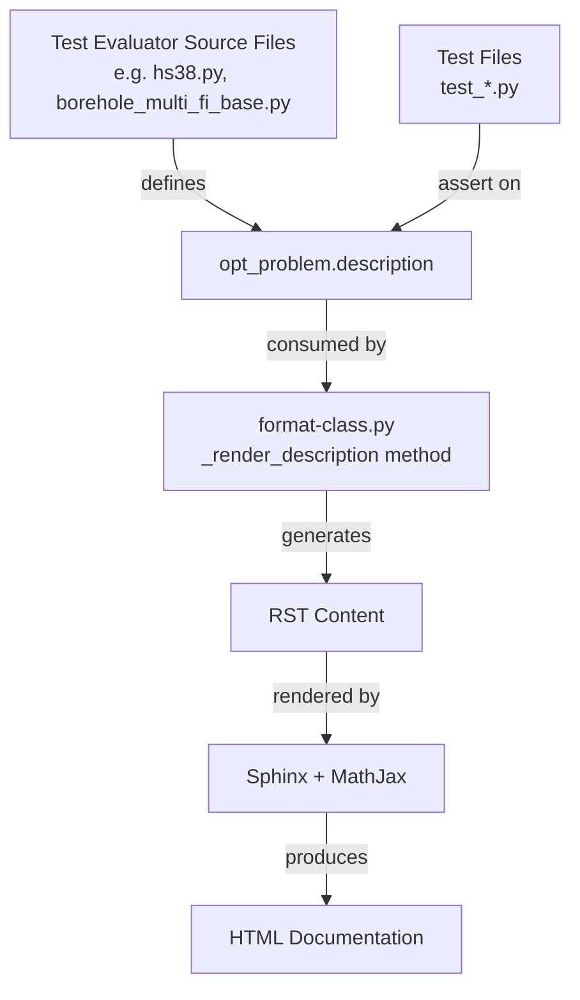
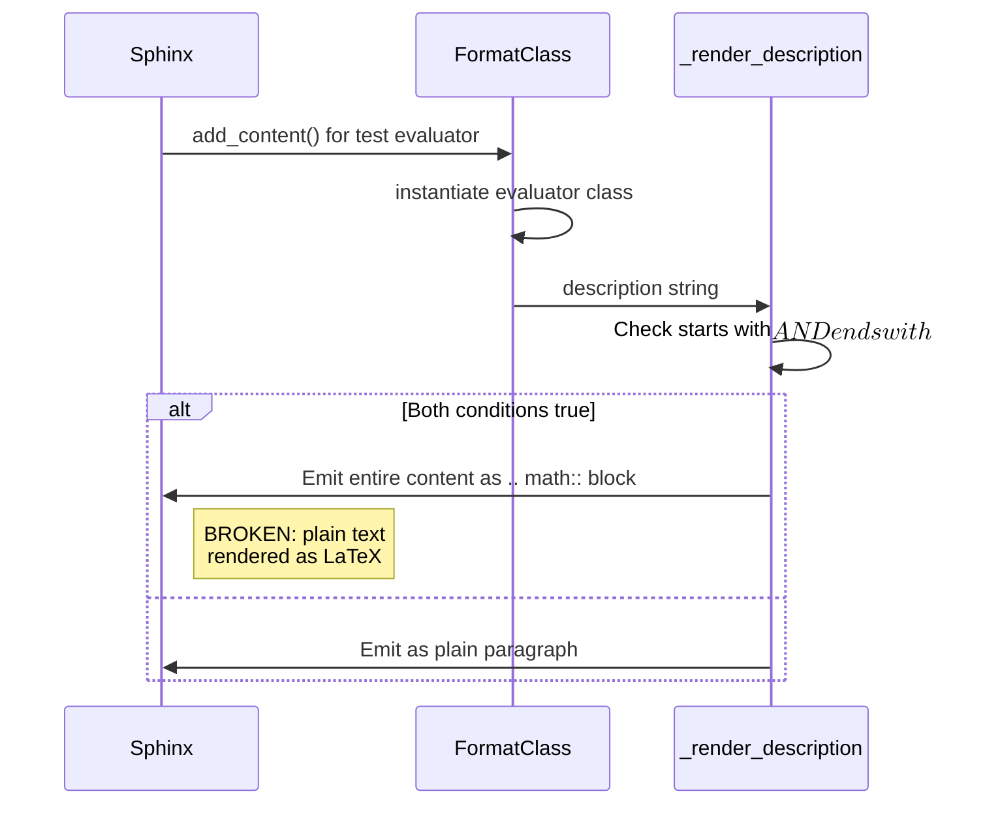
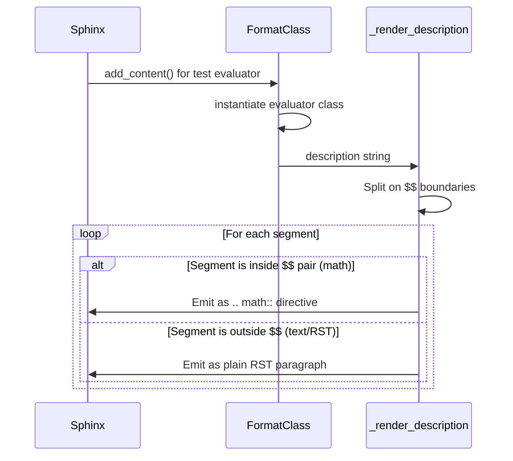

# Design Document: Fix Test Evaluator Documentation Rendering

## Overview

The Standard Evaluator project uses a custom Sphinx extension (`format-class.py`) to render `opt_problem.description` fields from test evaluator classes. The current `_render_description` method has a flawed heuristic: it checks whether the description string starts AND ends with `$$` delimiters, and if so, treats the entire content as a single `.. math::` block. This causes two rendering failures:

1. **Plain text treated as LaTeX math** — Many descriptions wrap plain English text (with Unicode math symbols and RST directives) inside `$$..$$` delimiters. The extension blindly renders all of this as a math block, producing broken LaTeX output.

2. **Mixed math/text in multi-`$$` blocks** — Descriptions with multiple `$$..$$` segments separated by plain text (e.g., HS38, HS47, G6Problem) fail because the extension only checks the first and last `$$`, treating everything in between as a single math block.

The fix involves two parts: (A) rewrite `_render_description` to correctly parse `$$`-delimited segments, and (B) fix the source description strings in ~20+ test evaluator files to properly separate LaTeX math from plain text/RST content. Corresponding test assertion files must also be updated.

## Architecture



The rendering pipeline flows from source description strings through the Sphinx extension to final HTML. Both the source strings and the extension logic need fixing.

## Sequence Diagrams

### Current (Broken) Rendering Flow



### Fixed Rendering Flow



## Components and Interfaces

### Component 1: `_render_description` method (in `format-class.py`)

**Purpose**: Parse an `opt_problem.description` string and emit correct RST content, handling three cases: pure text, pure math, and mixed content with multiple `$$..$$` segments.

**Interface**:
```python
def _render_description(self, description: str, source_name: str) -> None:
    """Render the opt_problem.description as formatted RST blocks.

    Splits the description on $$ boundaries. Text outside $$ pairs is
    rendered as plain RST paragraphs. Text inside $$ pairs is rendered
    inside .. math:: directives.

    Args:
        description: The stripped description string from opt_problem.
        source_name: The Sphinx source name for add_line calls.
    """
```

**Responsibilities**:
- Parse description into alternating text/math segments by splitting on `$$`
- Emit RST paragraph lines for text segments (preserving RST directives like `.. note::`)
- Emit `.. math::` directives for math segments
- Handle edge cases: empty segments, leading/trailing whitespace, descriptions with no `$$` at all

### Component 2: Source description strings (test evaluator files)

**Purpose**: Provide correctly formatted description strings that use `$$..$$` only around actual LaTeX math content.

**Responsibilities**:
- Plain text descriptions must NOT be wrapped in `$$..$$`
- Only actual LaTeX formulas go inside `$$..$$` delimiters
- RST directives (`:math:`, `.. math::`, `.. note::`) must NOT appear inside `$$` blocks
- Unicode math symbols in plain text remain as-is (they render fine as text)

### Component 3: Test assertion files

**Purpose**: Assert that `opt_problem.description` matches the expected value after source fixes.

**Responsibilities**:
- Update `expected_description` strings to match the new source descriptions
- Maintain existing assertion patterns (comparing stripped strings)

## Data Models

### Description Content Categories

```python
from enum import Enum
from typing import List, Tuple

class SegmentType(Enum):
    TEXT = "text"   # Plain RST content
    MATH = "math"   # LaTeX math content

# A parsed description is a list of (type, content) pairs
ParsedDescription = List[Tuple[SegmentType, str]]
```

**Validation Rules**:
- A segment of type MATH must contain valid LaTeX (no RST directives, no plain English prose)
- A segment of type TEXT may contain RST directives, plain text, Unicode characters
- Empty segments (whitespace only) are skipped during rendering

### Description String Patterns (Before/After)

| Pattern | Before (Broken) | After (Fixed) |
|---------|-----------------|---------------|
| Pure text | `r"""$$\nPlain text...\n$$"""` | `r"""Plain text..."""` |
| Pure math | `r"""$$\n\min f(x)\n$$"""` | `r"""$$\n\min f(x)\n$$"""` (unchanged) |
| Mixed | `r"""$$\nmath\n$$\ntext\n$$\nmath\n$$"""` | Same format, but text segments have NO `$$` wrappers |
| Text with RST inside $$ | `r"""$$\n.. math::\n    x=1\n$$"""` | `r""".. math::\n    x=1"""` |

## Key Functions with Formal Specifications

### Function 1: `_split_on_math_delimiters(description: str) -> List[Tuple[SegmentType, str]]`

```python
def _split_on_math_delimiters(description: str) -> List[Tuple[SegmentType, str]]:
    """Split a description string into alternating text/math segments.
    
    Splits on '$$' boundaries. Odd-indexed segments (0-based after split)
    are math content; even-indexed segments are text content.
    
    Args:
        description: The raw description string.
    
    Returns:
        List of (SegmentType, content) tuples with non-empty content.
    """
```

**Preconditions:**
- `description` is a non-empty string (already stripped by caller)

**Postconditions:**
- Returns a list of `(SegmentType, str)` tuples
- Segments alternate between TEXT and MATH (starting with TEXT if description doesn't start with `$$`)
- No segment has empty/whitespace-only content
- Concatenating all segment contents with `$$` delimiters reconstructs the original (modulo whitespace)

**Loop Invariants:**
- After processing index `i` of the split result: segments 0, 2, 4... are TEXT; segments 1, 3, 5... are MATH

### Function 2: `_render_description(self, description: str, source_name: str) -> None`

```python
def _render_description(self, description: str, source_name: str) -> None:
    """Render description as RST, handling mixed math/text content."""
```

**Preconditions:**
- `description` is non-empty and stripped
- `source_name` is a valid Sphinx source name

**Postconditions:**
- All math segments are emitted inside `.. math::` directives with proper indentation
- All text segments are emitted as plain RST lines
- The "Problem Description" heading is always emitted first
- A trailing blank line is always emitted last

## Algorithmic Pseudocode

### Main Rendering Algorithm

```python
def _render_description(self, description: str, source_name: str) -> None:
    # Emit heading
    self.add_line('|', source_name)
    self.add_line('', source_name)
    self.add_line('.. rst-class:: title', source_name)
    self.add_line('', source_name)
    self.add_line('**Problem Description**', source_name)
    self.add_line('', source_name)

    # Split description into segments
    segments = description.split('$$')
    
    # Determine if the description starts with a math block
    # If description starts with '$$', the first split element is empty string
    # and segment[1] is math, segment[2] is text, etc.
    starts_with_math = description.startswith('$$')
    
    for i, segment in enumerate(segments):
        content = segment.strip()
        if not content:
            continue
        
        # Determine if this segment is math or text
        # After split('$$'): if starts_with_math, odd indices are text, even are math
        # if NOT starts_with_math, even indices are text, odd are math
        if starts_with_math:
            is_math = (i % 2 == 1)  # indices 1, 3, 5... are math
        else:
            is_math = (i % 2 == 1)  # indices 1, 3, 5... are math
        
        if is_math:
            # Render as .. math:: directive
            self.add_line('.. math::', source_name)
            self.add_line('', source_name)
            for line in content.split('\n'):
                self.add_line('   ' + line, source_name)
            self.add_line('', source_name)
        else:
            # Render as plain RST paragraph
            for line in content.split('\n'):
                self.add_line(line, source_name)
            self.add_line('', source_name)
```

**Key Insight**: After `description.split('$$')`, the segments alternate between text and math. If the string starts with `$$`, the first element is an empty string and index 1 is the first math block. If it doesn't start with `$$`, index 0 is text and index 1 is math. In both cases, **odd-indexed segments are always math**.

### Description Fixing Algorithm (for source files)

For each affected source file:

```python
# Decision logic for each description:
# 1. If description content is ALL plain text (no LaTeX commands like \min, \frac, \begin):
#    -> Remove $$ wrappers entirely
#
# 2. If description has actual LaTeX math AND plain text mixed:
#    -> Keep $$ only around the LaTeX portions
#    -> Plain text between math blocks has no $$ wrappers
#
# 3. If description is pure LaTeX math:
#    -> Keep as-is (single $$...$$ wrapper is correct)
```

## Example Usage

### Example 1: Pure text description (borehole — currently broken)

**Before** (broken — entire text treated as math):
```python
new_prob.description = r"""$$
The Borehole function models water flow through a borehole...
Radius of borehole ( 𝑚 ) -  𝑟𝑤∈[0.05,0.15]
...
$$"""
```

**After** (fixed — rendered as plain RST):
```python
new_prob.description = """The Borehole function models water flow through a borehole. \
Its simplicity and quick evaluation makes it a commonly used function for testing \
a wide variety of methods in computer experiments.
The response is water flow rate in m³/yr.

Input Domain

- Radius of borehole (m): rw ∈ [0.05, 0.15]
- Radius of influence (m): r ∈ [100, 50000]
..."""
```

### Example 2: Mixed math and text (HS38 — currently broken)

**Before** (broken — text between math blocks treated as LaTeX):
```python
new_prob.description = r"""$$
\min f(x) = 100(x_2 - x_1^2)^2 + ...
$$

x0 = (-3.0, -1.0, -3.0, -1.0)

f(x0) = 19192.0
...
$$"""
```

**After** (fixed — proper segment separation):
```python
new_prob.description = r"""$$
\min f(x) = 100(x_2 - x_1^2)^2 + (1 - x_1)^2 + 90(x_4 - x_3^2)^2
+ (1-x_3)^2 + 10.1[(x_2-1)^2 + (x_4-1)^2] + 19.8(x_2-1)(x_4-1)
$$

x0 = (-3.0, -1.0, -3.0, -1.0)

f(x0) = 19192.0

x* = (1.0, 1.0, 1.0, 1.0)

f(x*) = 0.0"""
```

### Example 3: Pure math description (G6 — partially working)

**Before** (has trailing `$$` that captures text between blocks):
```python
new_prob.description = r"""$$
\begin{align}
    \min\quad & f(x) = (x_1 - 10)^3 + (x_2 - 20)^3 \\
    ...
\end{align}
$$

Variable bounds:
$$
13 \leq x_1 \leq 100, \quad 0 \leq x_2 \leq 100
$$

Known optimal solution:
$$
x^* = (14.095, 0.84296), \quad f(x^*) \approx -6961.81388
$$"""
```

This is already correctly structured for the new parser: math blocks are properly delimited with `$$` and text segments sit between them. The fixed `_render_description` handles this correctly without any changes to the source string.

### Example 4: The fixed `_render_description` handling all cases

```python
# Input: "$$\n\\min f(x)\n$$\n\nx0 = (1,2)\n\n$$\nx^* = (3,4)\n$$"
# Split on '$$': ['', '\n\\min f(x)\n', '\n\nx0 = (1,2)\n\n', '\nx^* = (3,4)\n', '']
# Index 0: '' -> skip (empty)
# Index 1: '\\min f(x)' -> MATH (odd index) -> .. math::
# Index 2: 'x0 = (1,2)' -> TEXT (even index) -> paragraph
# Index 3: 'x^* = (3,4)' -> MATH (odd index) -> .. math::
# Index 4: '' -> skip (empty)
```

## Error Handling

### Error Scenario 1: Description is empty or None

**Condition**: `opt_problem.description` is `None` or empty string
**Response**: The caller (`_print_test_info`) already checks `if description and description.strip()` before calling `_render_description`. No rendering occurs.
**Recovery**: N/A — graceful skip.

### Error Scenario 2: Unmatched `$$` delimiters

**Condition**: Description has an odd number of `$$` markers (e.g., starts with `$$` but never closes)
**Response**: The split-based approach still works — it treats segments at odd indices as math. An unmatched `$$` just means the last segment is text (even index) or an empty trailing segment.
**Recovery**: Content renders as best-effort. No crash.

### Error Scenario 3: LaTeX syntax errors inside `$$` blocks

**Condition**: Math content has invalid LaTeX (e.g., unclosed `\begin{align}`)
**Response**: MathJax will show an error in the rendered HTML, but Sphinx build won't fail. This is existing behavior and outside the scope of this fix.
**Recovery**: Author fixes the LaTeX in the source file.

## Testing Strategy

### Unit Testing Approach

- Verify that existing tests pass after description string updates (the test files assert exact string matches on `opt_problem.description`)
- Run `pytest tests/evaluators/test/` to ensure all description assertions pass
- Each modified source file has a corresponding test file that must be updated in lockstep

### Integration Testing Approach

- Run `sphinx-build` to generate HTML documentation and verify no build warnings related to math rendering
- Visually inspect rendered pages for the previously-broken evaluators (borehole, HS38, G6, trigonometric, etc.)
- Command: `.venv\Scripts\python.exe -m sphinx docs/source docs/build -b html`

### Property-Based Testing Approach

Property-based testing is appropriate for the `_render_description` parsing logic since it's a pure parsing function with clear input/output behavior.

**Property Test Library**: hypothesis

## Correctness Properties

*A property is a characteristic or behavior that should hold true across all valid executions of a system — essentially, a formal statement about what the system should do. Properties serve as the bridge between human-readable specifications and machine-verifiable correctness guarantees.*

### Property 1: Parsing produces correct text/math alternation

*For any* description string, splitting on `$$` boundaries SHALL produce segments where odd-indexed results (1, 3, 5...) are classified as math and even-indexed results (0, 2, 4...) are classified as text — regardless of whether the string starts with `$$`, ends with `$$`, or contains multiple `$$` pairs.

**Validates: Requirements 1.1, 6.1, 6.2**

### Property 2: Segment rendering format correctness

*For any* non-empty math segment, the rendered output SHALL contain a `.. math::` directive followed by the segment content with each line indented by exactly three spaces. *For any* non-empty text segment, the rendered output SHALL contain the segment content as plain lines without indentation prefix.

**Validates: Requirements 1.3, 1.4, 6.3**

### Property 3: Empty segments produce no output

*For any* description string where splitting on `$$` produces segments that are empty or whitespace-only, those segments SHALL be skipped and produce zero output lines in the rendered result.

**Validates: Requirements 1.5**

### Property 4: Structural output invariants

*For any* non-empty description string, the rendered output SHALL always begin with the "Problem Description" heading lines and always end with a trailing blank line.

**Validates: Requirements 1.6, 1.7**

### Property 5: Backward compatibility for simple descriptions

*For any* description string that contains no `$$` delimiters, the new Renderer SHALL produce identical output to rendering it as a plain RST paragraph. *For any* description string that is exactly `$$<content>$$` (single math block, no intermediate text), the new Renderer SHALL produce identical output to rendering the content as a single `.. math::` directive.

**Validates: Requirements 5.1, 5.2**

### Property 6: Round-trip segment reconstruction

*For any* description string, if we split it on `$$` and then reconstruct it by joining the segments with `$$` delimiters in their original positions, the result SHALL be equivalent to the original string (modulo leading/trailing whitespace on segments).

**Validates: Requirements 1.1, 1.2**

## Performance Considerations

No performance impact — the `_render_description` method runs once per test evaluator class during documentation build. The `str.split('$$')` operation is O(n) and descriptions are small strings (< 2KB).

## Security Considerations

Not applicable — this is a documentation rendering fix with no user-facing input, no network access, and no data persistence.

## Dependencies

- **Sphinx** (existing) — documentation build system
- **MathJax 4** (existing, loaded from CDN) — LaTeX rendering in HTML
- **autodocsumm** (existing) — base class for the custom documenter
- **hypothesis** (existing, already in dev dependencies) — property-based testing
