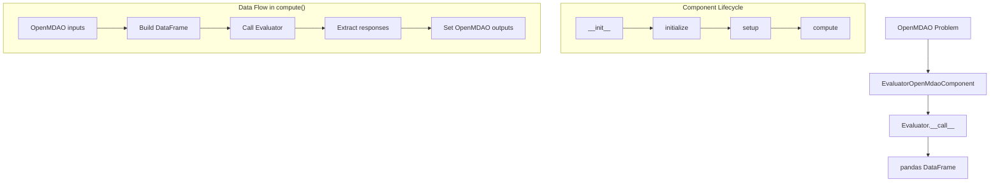

# Design Document

## Overview

This design describes the migration of `EvaluatorOpenMdaoComponent` from the boeing-standard-evaluator (bse) library into the standard-evaluator (se) library. The component wraps any `Evaluator` instance as an OpenMDAO `ExplicitComponent`, bridging the se evaluation API with the OpenMDAO data flow.

The key architectural change is replacing the legacy dict-based `problem` API (`self.eval.problem["variables"]`) with the pydantic `OptProblem` API (`self.eval.opt_problem.variables`). This means:
- Variable iteration switches from dict key/value pairs to a list of typed pydantic `Variable` objects
- Variable metadata (bounds, default, shift, scale) are accessed as attributes rather than dict keys
- Response metadata follows the same pattern

The component will be placed in a new `standard_evaluator.components` subpackage, keeping component logic separate from core evaluator logic.

## Architecture



The component follows the standard OpenMDAO `ExplicitComponent` lifecycle:
1. `__init__`: Store a deep copy of the evaluator (or reconstruct from serialized dict)
2. `initialize`: Declare `evaluator_options` OpenMDAO option if the evaluator is serializable
3. `setup`: Map `opt_problem.variables` → OpenMDAO inputs, `opt_problem.responses` → OpenMDAO outputs
4. `compute`: Convert inputs → DataFrame, call evaluator, extract responses → outputs

## Components and Interfaces

### Module Structure

```
standard_evaluator/
├── components/
│   ├── __init__.py              # exports EvaluatorOpenMdaoComponent
│   └── evaluator_om_component.py  # component implementation
├── evaluators/
│   └── abstract_evaluator.py   # Evaluator base class
├── surrogate_models/
│   └── abstract_model.py       # SurrogateModel with from_dict/to_dict
└── problem.py                  # OptProblem, Variable types
```

### Class Interface

```python
class EvaluatorOpenMdaoComponent(om.ExplicitComponent):
    """Expose a standard Evaluator as an OpenMDAO ExplicitComponent."""
    
    def __init__(self, evaluator: Evaluator = None, **kwargs: dict):
        """Initialize with evaluator instance or reconstruct from evaluator_options."""
        ...
    
    def initialize(self) -> None:
        """Declare evaluator_options option if evaluator supports to_dict()."""
        ...
    
    def setup(self) -> None:
        """Map OptProblem variables to inputs, responses to outputs."""
        ...
    
    def compute(self, inputs, outputs, discrete_inputs=None, discrete_outputs=None) -> None:
        """Build DataFrame from inputs, call evaluator, extract responses."""
        ...
```

### Dependencies

| Dependency | Purpose |
|---|---|
| `openmdao` | Parent class `om.ExplicitComponent` |
| `pandas` | DataFrame construction for evaluator calls |
| `copy` | Deep copy of evaluator in constructor |
| `numpy` | Infinity checks for bounds |

### Key Interactions

- **Evaluator → Component**: The component reads `evaluator.opt_problem.variables` and `evaluator.opt_problem.responses` to discover input/output metadata.
- **Component → Evaluator**: The `compute()` method calls `self.eval(data_frame)` where the evaluator modifies the DataFrame in place.
- **SurrogateModel → Component**: The fallback constructor path uses `SurrogateModel.from_dict(evaluator_options)` to reconstruct a serializable evaluator.

## Data Models

### Variable Access Patterns

The se `Variable` pydantic models (FloatVariable, IntVariable, ArrayVariable, CategoricalVariable) provide:

| Attribute | Type | Description |
|---|---|---|
| `.name` | `str` | Variable identifier used as OpenMDAO input/output name |
| `.bounds` | `Tuple[float, float]` | Lower and upper bounds; `-inf`/`+inf` for unbounded |
| `.default` | `float \| None` | Default value; `None` means calculate from bounds midpoint |
| `.shift` | `float` | Shift for scaling (default 0.0) |
| `.scale` | `float` | Scale factor (default 1.0, cannot be 0) |

### OpenMDAO Mapping

**Inputs** (from `opt_problem.variables`):
```python
add_input(name=var.name, val=default_value)
```
Where `default_value` is `var.default` if not None, otherwise calculated from bounds midpoint.

**Outputs** (from `opt_problem.responses`):
```python
add_output(
    name=resp.name,
    lower=lower_bound,   # None if -inf
    upper=upper_bound,   # None if +inf
    ref0=-resp.shift,
    ref=(1.0 / resp.scale) + ref0,
    val=0.0
)
```

### DataFrame Construction in compute()

```python
input_dict = {var_name: inputs[var_name] for var_name in self.eval.inputs}
data_frame = pd.DataFrame(data=input_dict)
self.eval(data_frame)  # modifies in-place
for response in self.eval.outputs:
    outputs[response] = data_frame[response].iloc[0]
```

## Correctness Properties

*A property is a characteristic or behavior that should hold true across all valid executions of a system—essentially, a formal statement about what the system should do. Properties serve as the bridge between human-readable specifications and machine-verifiable correctness guarantees.*

### Property 1: Deep Copy Isolation

*For any* Evaluator instance used to construct the component, mutating the original Evaluator's `opt_problem` after construction SHALL NOT affect the component's stored evaluator. The component's `eval` attribute remains an independent copy.

**Validates: Requirements 2.1**

### Property 2: Serialization Option Round Trip

*For any* Evaluator that has a `to_dict` method, after component initialization and the `initialize` lifecycle method, the component's `options["evaluator_options"]` SHALL equal the result of calling `to_dict()` on the original evaluator.

**Validates: Requirements 4.2**

### Property 3: Variable-to-Input Default Mapping

*For any* Variable in the evaluator's `opt_problem.variables`, the corresponding OpenMDAO input default value SHALL be `variable.default` if `variable.default` is not None, otherwise it SHALL be the midpoint of the variable's bounds `(lower + upper) / 2`.

**Validates: Requirements 5.2, 5.3, 5.4, 5.5**

### Property 4: Response-to-Output Bounds Mapping

*For any* response Variable in `opt_problem.responses`, the OpenMDAO output bounds SHALL be: the actual bound value when finite, or `None` when the bound is infinite (`-inf` for lower, `+inf` for upper).

**Validates: Requirements 6.3, 6.4**

### Property 5: Response Scaling Formula

*For any* response Variable with `shift` and `scale` values (where `scale != 0`), the OpenMDAO output `ref0` SHALL equal `-shift` and `ref` SHALL equal `(1.0 / scale) + ref0`.

**Validates: Requirements 6.5**

### Property 6: Compute Round Trip

*For any* TestEvaluator from `standard_evaluator.evaluators.test`, when the component is constructed, set up in an OpenMDAO problem, and `run_model()` is called with default inputs, the output values for every response SHALL match (within relative tolerance 1e-10) the values obtained by invoking the same evaluator directly with a DataFrame of the same default inputs.

**Validates: Requirements 7.1, 7.2, 7.3, 8.2, 8.3**

## Error Handling

| Condition | Error Type | Message |
|---|---|---|
| First positional arg is not an Evaluator | `TypeError` | Indicates expected type is `Evaluator` |
| No evaluator and no `evaluator_options` in kwargs | `AttributeError` | "No evaluator and no evaluator_options defined." |
| `SurrogateModel.from_dict()` fails | Propagated exception | Whatever `from_dict()` raises |
| `discrete_inputs` is not None | `ValueError` | "At this point we do not yet support discrete inputs" |
| `discrete_outputs` is not None | `ValueError` | "At this point we do not yet support discrete outputs" |
| Response scale is 0.0 | `ValueError` | "Response {name} has a scale value of 0.0" |
| Kwarg conflicts with internal attribute (e.g., 'eval') | Clear error | Raised before calling parent constructor |
| Evaluator raises during compute | Propagated exception | Unmodified from evaluator |

**Design Decisions:**
- Errors are raised eagerly (fail-fast) during construction or setup rather than deferring to compute time
- The component does not catch evaluator exceptions — they propagate naturally so OpenMDAO's error reporting works correctly
- Discrete variable support is explicitly rejected with informative messages since the evaluator API is DataFrame-based (continuous only)

## Testing Strategy

### Test Framework

- **Unit/Integration tests**: `pytest`
- **Property-based tests**: `hypothesis` (already a test dependency in pyproject.toml)
- **Minimum iterations**: 100 per property test

### Property-Based Tests

Each correctness property maps to one `hypothesis`-powered test:

1. **Deep Copy Isolation** — Generate evaluators with varying opt_problem structures, construct component, mutate original, verify isolation
2. **Serialization Option Round Trip** — Use SurrogateModel instances, verify options match to_dict()
3. **Variable-to-Input Default Mapping** — Generate FloatVariables with various defaults/bounds combinations, verify correct input defaults
4. **Response-to-Output Bounds Mapping** — Generate response Variables with mix of finite/infinite bounds, verify OpenMDAO output bounds
5. **Response Scaling Formula** — Generate response Variables with arbitrary shift/scale (scale ≠ 0), verify ref0 and ref computation
6. **Compute Round Trip** — Parametrize over TestEvaluators, verify component outputs match direct evaluator call

### Example-Based / Unit Tests

- Import resolution tests (Requirements 1.1–1.3)
- TypeError when non-Evaluator passed (Requirement 2.4)
- AttributeError when no evaluator or options (Requirement 3.2)
- ValueError for discrete inputs/outputs (Requirements 7.4, 7.5)
- ValueError for scale=0.0 response (Requirement 6.6)
- Kwarg conflict detection (Requirement 2.2)
- Exception propagation from SurrogateModel.from_dict (Requirement 3.3)
- Exception propagation from evaluator during compute (Requirement 7.6)

### Integration Tests

- End-to-end with HS100 evaluator (Requirement 8.1)
- SurrogateModel.from_dict reconstruction path (Requirement 3.1)

### Tag Format

Each property test will include a comment:
```python
# Feature: openmdao-component-migration, Property {N}: {property_text}
```

### Test File Location

```
tests/
└── components/
    ├── __init__.py
    ├── test_evaluator_om_component.py       # unit + integration tests
    └── test_pbt_evaluator_om_component.py   # property-based tests
```

