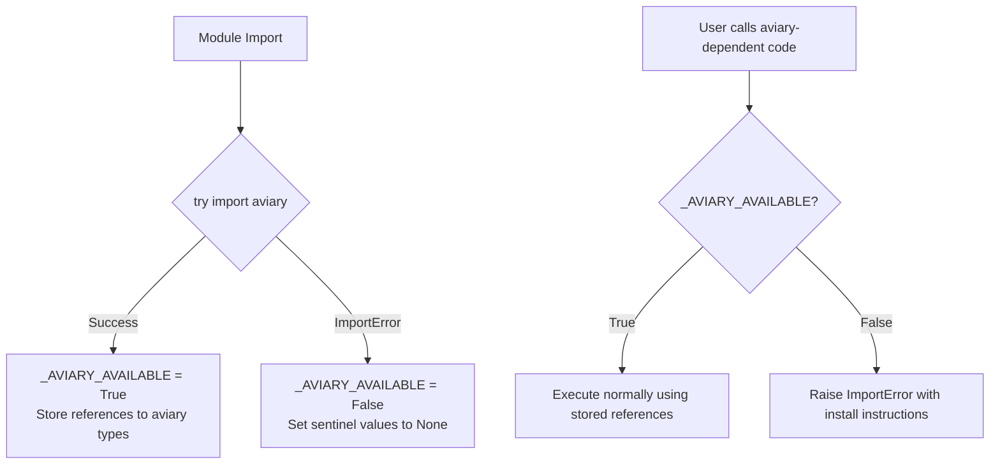

# Design Document: Optional Aviary Dependency

## Overview

This design makes `aviary` and `dymos` optional dependencies of the `standard-evaluator` package. The core idea is a **lazy import guard** pattern: modules can always be imported (no top-level `ImportError`), but executing aviary-dependent code paths raises a clear `ImportError` with installation instructions at runtime.

The implementation touches four files:
- `pyproject.toml` — moves aviary/dymos from hard to optional dependencies
- `src/standard_evaluator/aviary_encoder.py` — guards aviary/dymos type usage
- `src/standard_evaluator/standard_evaluator.py` — guards `_MetaData` import
- `src/standard_evaluator/om_converter.py` — guards aviary-specific functions
- `src/standard_evaluator/__init__.py` — ensures package imports cleanly without aviary

## Architecture

The architecture follows a **sentinel + execution-time check** pattern:



Key architectural decisions:
1. **Module-level try/except** sets availability flags and captures references
2. **Execution-time checks** are in `__init__` methods or function bodies (not at import time)
3. **Single helper function** `_require_aviary()` provides consistent error raising
4. **`__init__.py` unchanged** — it still imports `AviaryEncoder` and `StandardEval` at the top level, but those classes defer aviary usage to execution time

## Components and Interfaces

### Shared Guard Pattern

Each affected module implements the same pattern:

```python
# At module top level
try:
    import aviary
    from aviary.utils.aviary_values import AviaryValues
    # ... other aviary/dymos imports
    _AVIARY_AVAILABLE = True
except ImportError:
    _AVIARY_AVAILABLE = False
    # Set sentinel values for type references used in isinstance checks
    AviaryValues = None
    # ... other sentinels

def _require_aviary():
    """Raise ImportError if aviary is not available."""
    if not _AVIARY_AVAILABLE:
        raise ImportError(
            "aviary and dymos are required for this functionality. "
            "Install them with: pip install standard-evaluator[aviary]"
        )
```

### `pyproject.toml` Changes

```toml
# REMOVE from dependencies:
#   "aviary",

# ADD to optional-dependencies:
[project.optional-dependencies]
aviary = [
    "aviary",
    "dymos",
]
```

Note: `dymos` was never in the hard `dependencies` list but is imported by `aviary_encoder.py`. It becomes an explicit optional dependency alongside aviary.

### `aviary_encoder.py` Changes

- Wrap all `import aviary.*` and `import dymos` in try/except
- Set `_AVIARY_AVAILABLE` flag
- In `AviaryEncoder.__init__` (or by overriding `__init_subclass__` / adding an `__init__`), call `_require_aviary()`
- Since `AviaryEncoder` extends `json.JSONEncoder`, the guard goes in the `default()` method or a new `__init__` that calls `_require_aviary()` before `super().__init__()`
- Decision: Guard in `__init__` so the error surfaces at instantiation, not mid-serialization

```python
class AviaryEncoder(json.JSONEncoder):
    def __init__(self, *args, **kwargs):
        _require_aviary()
        super().__init__(*args, **kwargs)
    
    def default(self, obj):
        # ... existing logic unchanged, aviary types are available
```

### `standard_evaluator.py` Changes

- Wrap `from aviary.variable_info.variable_meta_data import _MetaData` in try/except
- Set `_MetaData = None` as sentinel when unavailable
- In `StandardEval.initialize()`, call `_require_aviary()` before setting `self.options["metadata"] = _MetaData`

```python
try:
    from aviary.variable_info.variable_meta_data import _MetaData
    _AVIARY_AVAILABLE = True
except ImportError:
    _AVIARY_AVAILABLE = False
    _MetaData = None

def _require_aviary():
    if not _AVIARY_AVAILABLE:
        raise ImportError(
            "aviary is required for StandardEval. "
            "Install it with: pip install standard-evaluator[aviary]"
        )

class StandardEval(StandardBase):
    def initialize(self):
        _require_aviary()
        super().initialize()
        self.options.declare("metadata", types=dict, desc="...")
        self.options["metadata"] = _MetaData
```

### `om_converter.py` Changes

- Wrap aviary imports (`AviaryValues`, `EngineDeck`) in try/except
- Set sentinels when unavailable
- Add `_require_aviary()` calls at the start of functions that use aviary types:
  - `convert_aviary()`
  - `convert_engine_deck()`
  - `convert_enum()` (uses aviary enums indirectly)
- Functions that don't directly use aviary types (e.g., `get_interface`, `create_problem`) remain unguarded — they'll naturally fail if passed aviary objects, which is expected

```python
try:
    from aviary.utils.aviary_values import AviaryValues
    from aviary.subsystems.propulsion.engine_deck import EngineDeck
    _AVIARY_AVAILABLE = True
except ImportError:
    _AVIARY_AVAILABLE = False
    AviaryValues = None
    EngineDeck = None

def _require_aviary():
    if not _AVIARY_AVAILABLE:
        raise ImportError(
            "aviary is required for this functionality. "
            "Install it with: pip install standard-evaluator[aviary]"
        )
```

### `__init__.py` Changes

The `__init__.py` imports `AviaryEncoder` and om_converter functions. Since those modules now import cleanly without aviary, no changes are needed to `__init__.py` itself. The imports will succeed — the guard only fires at execution time.

However, if there's a transitive import issue (e.g., `om_converter.py` imports `AviaryEncoder` at module level from the package), we need to ensure that chain also uses guarded imports. Looking at the current code, `om_converter.py` does `from standard_evaluator import AviaryEncoder` which goes through `__init__.py`. Since `aviary_encoder.py` will now import cleanly, this chain works.

## Data Models

No new data models are introduced. Existing models (`AviaryEncoder`, `StandardEval`, `EvaluatorInfo`, etc.) remain unchanged in their interfaces and behavior when aviary is installed.

The only new "data" is the module-level boolean flag:

```python
_AVIARY_AVAILABLE: bool  # Set at module import time via try/except
```

## Correctness Properties

*A property is a characteristic or behavior that should hold true across all valid executions of a system — essentially, a formal statement about what the system should do. Properties serve as the bridge between human-readable specifications and machine-verifiable correctness guarantees.*

### Property 1: Lazy guard raises with install instructions for all guarded entry points

*For any* aviary-dependent entry point (AviaryEncoder instantiation, StandardEval instantiation, convert_aviary() call, convert_engine_deck() call), when aviary is not installed, importing the containing module shall succeed without error, AND invoking the entry point shall raise an `ImportError` whose message contains the text "pip install standard-evaluator[aviary]".

**Validates: Requirements 3.1, 3.2, 3.3, 3.4, 5.2, 5.3**

### Property 2: AviaryEncoder type-marker round trip

*For any* valid aviary-typed object (AviaryValues instance, aviary Enum, EngineDeck, pathlib.WindowsPath, set, tuple, numpy array, OptionsDictionary), when aviary IS installed, `AviaryEncoder().default(obj)` shall produce a dictionary containing a recognizable type-marker key (e.g., `__aviary_values__`, `__enum__`, `__EngineDeck__`) that uniquely identifies the original type.

**Validates: Requirements 4.1**

## Error Handling

| Scenario | Error Type | Message Pattern |
|----------|-----------|-----------------|
| Instantiate `AviaryEncoder` without aviary | `ImportError` | "...pip install standard-evaluator[aviary]" |
| Instantiate `StandardEval` without aviary | `ImportError` | "...pip install standard-evaluator[aviary]" |
| Call `convert_aviary()` without aviary | `ImportError` | "...pip install standard-evaluator[aviary]" |
| Call `convert_engine_deck()` without aviary | `ImportError` | "...pip install standard-evaluator[aviary]" |
| Import `standard_evaluator` without aviary | No error — succeeds | N/A |

All errors are `ImportError` (not `RuntimeError` or custom exceptions) because:
1. It's semantically correct — the issue IS a missing import
2. It's consistent with Python ecosystem conventions (e.g., scipy optional backends)
3. Users can catch `ImportError` specifically to detect missing optional dependencies

## Testing Strategy

### Unit Tests (example-based)

1. **Import without aviary**: Mock aviary absence, verify `import standard_evaluator` succeeds
2. **All symbols accessible**: With aviary absent, verify all non-aviary symbols in `__all__` are usable
3. **AviaryEncoder raises**: With aviary absent, verify `AviaryEncoder()` raises `ImportError`
4. **StandardEval raises**: With aviary absent, verify `StandardEval()` raises `ImportError`
5. **convert_aviary raises**: With aviary absent, verify `convert_aviary({})` raises `ImportError`
6. **convert_engine_deck raises**: With aviary absent, verify `convert_engine_deck({})` raises `ImportError`
7. **Error message content**: Verify all raised errors contain "pip install standard-evaluator[aviary]"
8. **Backward compat (aviary present)**: Verify `StandardEval().options["metadata"]` is `_MetaData`
9. **pyproject.toml structure**: Verify aviary/dymos in optional-dependencies, not in dependencies

### Property-Based Tests

**Library**: `hypothesis` (already a test dependency in the project)

**Configuration**: Minimum 100 iterations per property test.

Each property test is tagged with:
- **Feature: optional-aviary-dependency, Property {number}: {property_text}**

**Property 1 test**: Generate random entry point selections from the set {AviaryEncoder, StandardEval, convert_aviary, convert_engine_deck}. For each, verify:
- The containing module imports without error
- Invoking the entry point raises `ImportError`
- The error message contains "pip install standard-evaluator[aviary]"

**Property 2 test** (requires aviary installed): Generate random aviary-typed objects (random Enum values, random AviaryValues dicts, random WindowsPath strings, random numpy arrays, random sets, random tuples). For each, verify `AviaryEncoder().default(obj)` returns a dict with the expected type-marker key.

### Test Execution

- Tests requiring aviary absence: Use `unittest.mock.patch.dict(sys.modules, ...)` to simulate aviary not being installed, combined with `importlib.reload()` of the affected modules
- Tests requiring aviary presence: Run normally (aviary is installed in the dev environment)
- Property tests run with `hypothesis` using `@settings(max_examples=100)`
