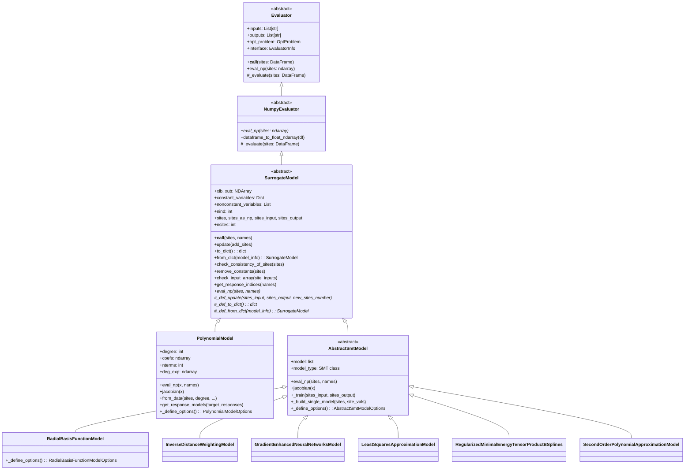
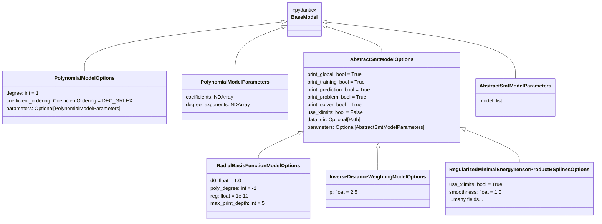

# Design Document: Surrogate Model Migration

## Overview

This design describes the migration of surrogate model classes from `boeing_standard_evaluator` into `standard_evaluator`. The migration is a code-copy-and-repoint operation: source files are duplicated into the target package, all `boeing_standard_evaluator` import paths are replaced with `standard_evaluator` equivalents, and any missing utility dependencies are also migrated.

The target architecture builds on the already-migrated evaluator hierarchy (`Evaluator` → `NumpyEvaluator`) in `standard_evaluator.evaluators`. After this migration, `standard_evaluator` will support building, training, serializing, and evaluating surrogate models independently.

### Key Design Decisions

1. **Copy-and-repoint strategy** — Source files are copied verbatim (minus proprietary notices) with only import paths changed. No algorithmic refactoring occurs during migration.
2. **Optional dependency for SMT** — The `smt` package is an optional dependency (`pip install standard_evaluator[smt]`). The `smt_models` subpackage raises a clear `ImportError` when `smt` is absent, while the parent `surrogate_models` package remains importable.
3. **Pydantic options system preserved** — All models use the existing `_define_options()` / `lookup_option_value()` pattern established in the evaluator hierarchy.
4. **Dask parallelism retained** — `AbstractSmtModel._train()` uses `@dask.delayed` and `dask.compute` for per-response parallel training.

## Architecture



### Package Layout (Post-Migration)

```
src/standard_evaluator/
├── __init__.py                          # Add surrogate_models to __all__
├── evaluators/
│   ├── abstract_evaluator.py            # Evaluator base (already exists)
│   └── numpy_evaluator.py              # NumpyEvaluator (already exists)
├── surrogate_models/
│   ├── __init__.py                      # Exports all model classes
│   ├── abstract_model.py               # SurrogateModel ABC
│   ├── polynomial_model.py             # PolynomialModel + Options + Enum
│   ├── polynomial_model_utils/
│   │   ├── __init__.py
│   │   └── monomial_ordering.py        # grlex/grrevlex utilities
│   └── smt_models/
│       ├── __init__.py                  # Conditional import with ImportError guard
│       ├── abstract_smt_model.py        # AbstractSmtModel + Options + helper
│       ├── rbf_model_using_smt.py
│       ├── idw_model_using_smt.py
│       ├── genn_model_using_smt.py
│       ├── ls_model_using_smt.py
│       ├── rmts_model_using_smt.py
│       └── sopa_model_using_smt.py
├── utilities/
│   ├── __init__.py                      # Already exports needed utilities
│   ├── utility.py                       # Has remove_duplicates, get_constant_vars, restrict_problem
│   ├── problem_dict_utility.py          # Has legacy_to_opt_problem
│   └── opt_problem_utility.py           # NEW: get_opt_problem_constant_vars
├── problem.py                           # OptProblem (already exists)
├── evaluator.py                         # EvaluatorInfo (already exists)
└── converters.py                        # evaluator_info_to_opt_problem (already exists)
```

## Components and Interfaces

### 1. SurrogateModel (abstract_model.py)

**Inherits from:** `standard_evaluator.evaluators.NumpyEvaluator`

**Constructor parameters:**
- `sites: pd.DataFrame` — Training sites (inputs + responses)
- `name: Optional[str]` — Model identifier
- `comp_cost: float = 100`
- `cache: str = None`
- `cache_options: dict = None`
- `logging: bool = False`
- `interface: EvaluatorInfo = None`
- `opt_problem: OptProblem = None`
- `num_independent: int = None`
- `num_dependent: int = None`
- `options: Optional[BaseModel] = None`

**Key behaviors:**
- On construction, validates sites against the problem definition, removes duplicates, stores a copy
- `to_dict()` → returns `{type, info, problem, version, name, design explorer version}`
- `from_dict(model_info)` → dispatches to correct subclass via `type` field
- `update(add_sites)` → merges new sites with existing, calls `_def_update`
- `remove_constants(sites)` → strips constant-valued variables from DataFrame, returns ndarray

**Import changes:**
| Source import | Target import |
|---|---|
| `boeing_standard_evaluator.evaluators.NumpyEvaluator` | `standard_evaluator.evaluators.NumpyEvaluator` |
| `boeing_standard_evaluator.utilities` | `standard_evaluator.utilities` |
| `boeing_standard_evaluator.opt_problem.OptProblem` | `standard_evaluator.problem.OptProblem` |
| `boeing_standard_evaluator.evaluator_info.EvaluatorInfo` | `standard_evaluator.evaluator.EvaluatorInfo` |
| `boeing_standard_evaluator.conversions.evaluator_info_to_opt_problem` | `standard_evaluator.converters.evaluator_info_to_opt_problem` |
| `version("boeing_standard_evaluator")` | `version("standard_evaluator")` |

### 2. PolynomialModel (polynomial_model.py)

**Inherits from:** `standard_evaluator.surrogate_models.abstract_model.SurrogateModel`

**Contains:**
- `CoefficientOrdering` enum — `DEC_GRLEX`, `ASC_GRLEX`, `DEC_GRREVLEX`, `ASC_GRREVLEX`
- `PolynomialModelParameters(BaseModel)` — stores coefficients and degree_exponents as NDArrays
- `PolynomialModelOptions(BaseModel)` — degree, coefficient_ordering, parameters
- `PolynomialModel` class — fitting via least-squares, analytic Jacobian, serialization
- `convert_df_datatypes_to_list()` helper function

**Key methods:**
- `eval_np(x, names)` — monomial evaluation via vectorized NumPy
- `jacobian(x)` — analytical derivative computation
- `from_data(sites, degree, ...)` — factory classmethod
- `get_response_models(target_responses)` — projects model to subset of responses
- `_model_building(sites, degree)` — least-squares coefficient fitting

### 3. Monomial Ordering Utilities (polynomial_model_utils/monomial_ordering.py)

Pure functions, no external dependencies beyond standard Python:
- `next_grlex(monomial, nind)` → next monomial in graded lexicographic order
- `grlex_ordering_to_deg(nind, max_deg)` → all monomials up to max_deg in grlex
- `next_grrevlex(monomial, nind)` → next monomial in graded reverse lex order
- `grrevlex_ordering_to_deg(nind, max_deg)` → all monomials up to max_deg in grrevlex

### 4. AbstractSmtModel (smt_models/abstract_smt_model.py)

**Inherits from:** `standard_evaluator.surrogate_models.abstract_model.SurrogateModel`

**Contains:**
- `AbstractSmtModelParameters(BaseModel)` — stores list of trained SMT model objects
- `AbstractSmtModelOptions(BaseModel)` — print toggles, `use_xlimits`, `data_dir`, parameters
- `_options_to_smt_dict(options, opt_problem, nonconstant_variables)` — converts Pydantic options to SMT constructor kwargs
- `AbstractSmtModel` class — Dask-parallel training, per-response prediction

**Dask training flow:**
1. `__init__` calls `_train(sites_input, sites_output)` unless pre-trained parameters provided
2. `_train` creates a list of `@dask.delayed` calls to `_build_single_model` (one per response)
3. `dask.compute(*sm_builds)` executes training in parallel
4. Trained models stored in `self._options.parameters.model`

**Serialization:**
- `_def_to_dict()` → serializes options (excluding non-serializable trained objects) + site data
- `_def_from_dict(model_info)` → reconstructs DataFrame from stored sites, retrains model

### 5. Concrete SMT Models

Each follows an identical pattern:
- Defines an `*Options(AbstractSmtModelOptions)` Pydantic model with model-specific fields
- Defines a model class inheriting `AbstractSmtModel`
- Constructor passes the corresponding `smt.surrogate_models.*` class as `model_type`

| Class | SMT Type | Notable Options |
|---|---|---|
| `RadialBasisFunctionModel` | `RBF` | `d0`, `poly_degree`, `reg`, `max_print_depth` |
| `InverseDistanceWeightingModel` | `IDW` | `p` |
| `GradientEnhancedNeuralNetworksModel` | `GENN` | `alpha`, `beta1/2`, `lambd`, `gamma`, `hidden_layer_sizes`, etc. |
| `LeastSquaresApproximationModel` | `LS` | (no additional fields) |
| `RegularizedMinimalEnergyTensorProductBSplines` | `RMTB` | `smoothness`, `regularization_weight`, `use_xlimits=True`, etc. |
| `SecondOrderPolynomialApproximationModel` | `QP` | (no additional fields) |

### 6. Supporting Utility: get_opt_problem_constant_vars

**Location:** `src/standard_evaluator/utilities/opt_problem_utility.py` (new file)

This utility is referenced by `PolynomialModel` (in the source it comes from `boeing_standard_evaluator.utilities.opt_problem_utility`). It determines which variables in an `OptProblem` have equal lower/upper bounds and are therefore constant.

**Signature:** `get_opt_problem_constant_vars(problem: OptProblem) -> Dict[int, Tuple[str, float]]`

The existing `get_constant_vars` in `standard_evaluator.utilities.utility` operates on legacy dict-format problems. The new `get_opt_problem_constant_vars` operates on `OptProblem` instances directly.

### 7. smt_models/__init__.py Import Guard

The `smt_models/__init__.py` wraps its imports in a try/except:

```python
try:
    from standard_evaluator.surrogate_models.smt_models.abstract_smt_model import (
        AbstractSmtModel, ...
    )
    # ... all concrete model imports ...
except ImportError:
    raise ImportError(
        "The 'smt' package is required to use SMT surrogate models. "
        "Install it with: pip install standard_evaluator[smt]"
    )
```

The parent `surrogate_models/__init__.py` does NOT eagerly import from `smt_models` — it uses a lazy pattern or only imports non-SMT classes at top level, adding SMT classes conditionally.

## Data Models

### OptProblem (already exists)

The `OptProblem` Pydantic model at `standard_evaluator.problem` provides variable/response definitions including bounds, types, and defaults. Surrogate models use it to:
- Determine constant vs. non-constant variables
- Compute `xlimits` for SMT models
- Validate site data consistency

### Pydantic Options Hierarchy



### Serialization Format (to_dict / from_dict)

```python
{
    "type": "PolynomialModel",  # or "RadialBasisFunctionModel", etc.
    "info": {
        # Model-specific data (sites, options, parameters)
    },
    "problem": { ... },          # OptProblem serialized as dict
    "version": "x.y.z",         # standard_evaluator version
    "name": "model_name",
    "design explorer version": "Design Explorer 6"
}
```

## Correctness Properties

*A property is a characteristic or behavior that should hold true across all valid executions of a system — essentially, a formal statement about what the system should do. Properties serve as the bridge between human-readable specifications and machine-verifiable correctness guarantees.*

### Property 1: Monomial ordering correctness

*For any* valid number of independent variables `nind ≥ 1` and maximum degree `max_deg ≥ 0`, the monomial lists produced by `grlex_ordering_to_deg` and `grrevlex_ordering_to_deg` SHALL:
- Begin with the zero-degree monomial `[0, 0, ..., 0]`
- Contain exactly the expected number of monomials (the binomial coefficient C(nind + max_deg, max_deg))
- Have non-decreasing total degree across the list
- Contain no duplicate entries

**Validates: Requirements 3.3, 3.4**

### Property 2: Polynomial model least-squares fit accuracy

*For any* valid set of training sites (with non-constant variables and sufficient points for the requested degree), fitting a `PolynomialModel` and evaluating it at the training sites SHALL reproduce the training response values within a tolerance of 1e-10 (i.e., the polynomial interpolates or closely approximates its training data).

**Validates: Requirements 4.5**

### Property 3: Polynomial Jacobian consistency with finite differences

*For any* trained `PolynomialModel` and any valid input point `x` within the model's input bounds, the analytical Jacobian returned by `jacobian(x)` SHALL agree with the central finite-difference approximation of the model's `eval_np` within a tolerance of 1e-6.

**Validates: Requirements 4.6**

### Property 4: PolynomialModel serialization round-trip

*For any* valid trained `PolynomialModel`, calling `to_dict()` followed by `from_dict()` on the result SHALL produce a reconstructed model whose predictions at any input point are numerically identical (within tolerance 1e-12) to the original model's predictions.

**Validates: Requirements 4.7, 17.3, 17.4**

### Property 5: _options_to_smt_dict conversion correctness

*For any* valid `AbstractSmtModelOptions` instance (or subclass instance), the dictionary produced by `_options_to_smt_dict` SHALL:
- NOT contain the keys `parameters`, `use_xlimits`, or `data_dir`
- Contain `xlimits` computed from `OptProblem` variable bounds when `use_xlimits` is True
- Contain all other option fields with their current values

**Validates: Requirements 5.7**

### Property 6: SMT model serialization round-trip

*For any* valid trained SMT model (RBF, IDW, LS, RMTS, SOPA), calling `to_dict()` followed by `from_dict()` on the result SHALL produce a reconstructed model whose predictions at a set of test points are numerically close (within tolerance 1e-10) to the original model's predictions.

**Validates: Requirements 5.8, 17.5**

### Property 7: SMT model training produces valid predictions

*For any* valid training data (sufficient sites with non-constant variables) and any concrete SMT model class (RBF, IDW, LS, RMTS, SOPA), instantiating the model SHALL:
- Complete training without error
- Produce finite-valued predictions for any input within the training bounds
- Produce no `NaN` or `Inf` values in the output

**Validates: Requirements 6.5, 7.5, 9.5, 10.5, 11.5**

## Error Handling

| Scenario | Expected Behavior |
|---|---|
| `sites` is not a DataFrame on construction | `TypeError` raised by `check_consistency_of_sites` |
| Sites missing an input variable | `ValueError` from `check_consistency_of_sites` |
| Fixed variable has wrong value in sites | `ValueError` from `check_consistency_of_sites` |
| `update()` receives wrong type | `TypeError` |
| `update()` array has wrong column count | `ValueError` |
| Duplicate sites with conflicting responses | `ValueError` from `remove_duplicates` |
| `from_dict()` receives non-dict | `TypeError` |
| `from_dict()` missing required keys | `KeyError` |
| `from_dict()` has unknown model type | `NameError` |
| `from_dict()` type mismatch with concrete class | `ValueError` |
| `smt` not installed, user imports `smt_models` | `ImportError` with install guidance |
| SMT training failure | Exception propagated from SMT library |
| `eval_np` receives wrong-shaped array | `TypeError` from `check_input_array` |
| Invalid `poly_degree` for RBF options | `ValueError` from Pydantic validator |

## Testing Strategy

### Test Organization

```
tests/surrogate_models/
├── test_abstract_model.py              # SurrogateModel ABC tests
├── test_polynomial_model.py            # PolynomialModel tests (unit + property)
├── test_data/                          # Fixture data files
│   ├── serialization_test.yml
│   └── test.yml
└── smt_models/
    ├── conftest.py                      # Shared fixtures (site generators, problem builders)
    ├── test_abstract_smt_model_options.py
    ├── test_genn_model_using_smt.py
    ├── test_idw_model_using_smt.py
    ├── test_ls_model_using_smt.py
    ├── test_rbf_model_using_smt.py
    ├── test_rmts_model_using_smt.py
    ├── test_sopa_model_using_smt.py
    ├── test_smt_serialization.py
    ├── test_smt_wrapper_options.py
    ├── test_smt_wrapper_validation.py
    └── test_options_to_smt_dict.py
```

### Dual Testing Approach

**Unit tests** cover:
- Import success/failure scenarios
- Class hierarchy verification (issubclass checks)
- Error condition handling (TypeError, ValueError, KeyError)
- Specific example evaluations with known answers
- Static code checks (no `boeing_standard_evaluator` references)
- Pydantic options defaults and validation

**Property tests** cover:
- Monomial ordering invariants (Property 1)
- Polynomial fit accuracy on random data (Property 2)
- Jacobian vs. finite-difference consistency (Property 3)
- Serialization round-trip for all model types (Properties 4, 6)
- Options-to-dict conversion correctness (Property 5)
- SMT model training correctness (Property 7)

### Property-Based Testing Configuration

- **Library:** `hypothesis` (already in test dependencies)
- **Minimum iterations:** 100 per property test
- **Tag format:** `Feature: surrogate-model-migration, Property {N}: {title}`

Each property test uses Hypothesis strategies to generate:
- Random `nind` (1-5) and `max_deg` (0-4) for monomial tests
- Random site DataFrames with valid bounds and sufficient points for polynomial/SMT tests
- Random `OptProblem` instances with varying numbers of variables and responses

### Test Dependencies

- `pytest` — test runner
- `hypothesis` — property-based testing
- `numdifftools` — finite-difference Jacobian verification
- `smt>=2.10.1` — required for SMT model tests (via `surrogate` optional group)
- `dask` — required for parallel training tests
