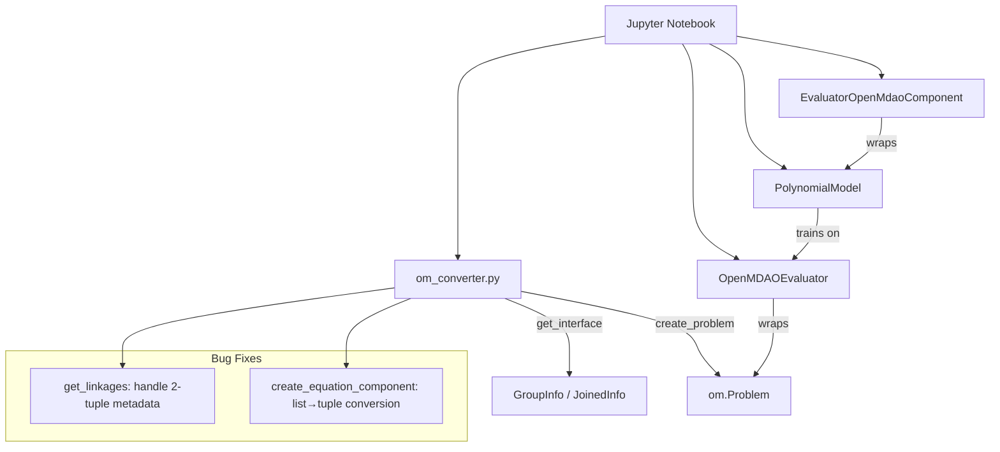
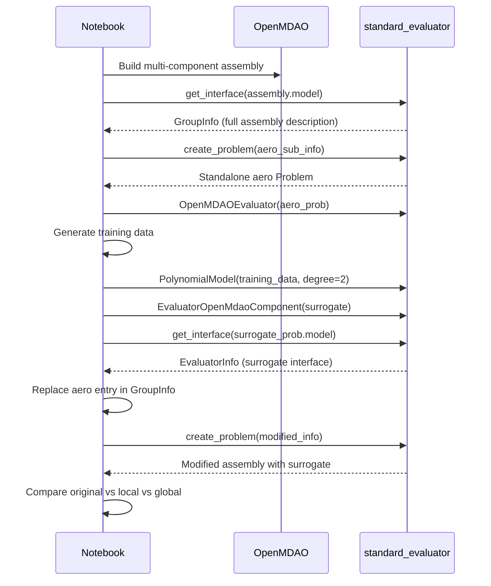

# Design Document: Surrogate Replacement Demo

## Overview

This feature delivers two bug fixes in `om_converter.py` and a Jupyter notebook demonstrating the full surrogate replacement workflow. The bug fixes address:

1. An `IndexError` in `get_linkages()` when OpenMDAO 3.43 returns 2-tuple connection metadata (previously assumed 3-tuples)
2. A `TypeError` in `create_problem()` when reconstructing ExecComp components whose `default_shape` option was serialized as a list instead of a tuple

The notebook (`docs/source/demos/surrogate_replacement_workflow.ipynb`) demonstrates creating an ExecComp-based multi-component assembly, capturing its interface, extracting and replacing an expensive sub-group with a polynomial surrogate, and comparing accuracy across original, locally-replaced, and global surrogate evaluators.

## Architecture

The solution integrates existing library components without introducing new modules:



**Workflow flow:**



## Components and Interfaces

### Bug Fix 1: `get_linkages()` in `om_converter.py`

**Current code (lines 82-87):**
```python
def get_linkages(om_group: om.Group):
    linkage = []
    for key, value in om_group._manual_connections.items():
        if (value[1] is not None) | (value[2] is not None):
            print(f"Indexing used: ...")
        linkage.append((value[0], key))
    return linkage
```

**Problem:** OpenMDAO 3.43 changed `_manual_connections` values from 3-tuples `(source, src_indices, flat_src_indices)` to 2-tuples `(source, metadata_dict)`. Accessing `value[2]` on a 2-tuple raises `IndexError`.

**Fix:** Check tuple length before accessing elements beyond index 1. For 2-tuples, extract the source from `value[0]`. For longer tuples, preserve the existing diagnostic logic.

```python
def get_linkages(om_group: om.Group):
    linkage = []
    for key, value in om_group._manual_connections.items():
        if len(value) > 2:
            if (value[1] is not None) | (value[2] is not None):
                print(f"Indexing used: {key}, {value}, {type(value[0])}, {type(value[1])}, {type(value[2])}")
        linkage.append((value[0], key))
    return linkage
```

### Bug Fix 2: `create_equation_component()` in `om_converter.py`

**Problem:** When `get_interface()` serializes an ExecComp's options, tuple values like `default_shape = (3,)` are stored as JSON lists `[3]`. When `create_problem()` reconstructs the component, these lists are passed to OpenMDAO's ExecComp constructor, which expects tuples for shape-related options, causing a `TypeError`.

**Fix:** In `create_openmdao_options()`, convert any list values back to tuples before returning. This handles `default_shape` and any other shape-like options generically.

```python
def create_openmdao_options(info_dict: dict) -> dict:
    minimal_dict = {}
    local_dict = info_dict['_dict']
    del_avairy = False
    for name, info in local_dict.items():
        if name == 'aviary_options':
            if '__aviary_values__' in info['val']:
                local_dict[name] = convert_aviary(info['val']['__aviary_values__'])
            else:
                del_avairy = True
        else:
            # Convert list values to tuples (JSON serialization turns tuples into lists)
            if isinstance(info['val'], list):
                local_dict[name] = tuple(info['val'])
            else:
                local_dict[name] = info['val']
    if del_avairy:
        del(local_dict['aviary_options'])
    return local_dict
```

### Notebook: `docs/source/demos/surrogate_replacement_workflow.ipynb`

The notebook is structured in sequential sections:

1. **Imports** — `import standard_evaluator as se`, `import openmdao.api as om`, numpy, pandas, matplotlib
2. **Assembly Creation** — Builds a 3-group assembly (aero, structures, performance) using ExecComp, with internal `connect()` in the aero sub-group
3. **Interface Capture** — `se.get_interface()` + `se.show_structure()`
4. **Aero Extraction** — Extract aero sub-group via `se.create_problem()`, wrap as `OpenMDAOEvaluator`
5. **Surrogate Training** — Generate training sites, evaluate, build `PolynomialModel(degree=2)`
6. **Component Replacement** — Replace aero entry in GroupInfo, rebuild assembly via `se.create_problem()`
7. **Global Surrogate** — Train a polynomial on full assembly I/O
8. **Comparison** — Evaluate all three on test sites, display error table + scatter + box plots

### Assembly Design

```
assembly (Group, promotes=['*'])
├── aero (Group, with internal connect())
│   ├── pressure_calc (ExecComp): pressure = 0.5 * rho * v**2
│   ├── lift_calc (ExecComp): lift = cl * q * area  [q connected from pressure_calc]
│   └── drag_calc (ExecComp): drag = cd * q * area  [q connected from pressure_calc]
├── structures (Group)
│   ├── weight_calc (ExecComp): weight = density * volume * g
│   └── stress_calc (ExecComp): stress = force / area_struct
└── performance (Group)
    └── range_calc (ExecComp): range_out = (lift / drag) * (fuel / sfc)
```

Key design decisions:
- **ExecComp-only**: No external dependencies; reproducible on any machine with OpenMDAO installed
- **Internal `connect()`** in aero group: Demonstrates the Bug 1 fix by forcing `_manual_connections` usage
- **Promotions** at top level: Standard pattern for connecting groups; matches existing demo conventions
- **Separate outputs** (weight, stress): Verifies that local surrogate replacement doesn't break non-aero pathways

## Data Models

No new data models are introduced. The feature uses existing Pydantic models:

| Model | Module | Role |
|-------|--------|------|
| `GroupInfo` | `evaluator.py` | Serialized assembly with components, promotions, linkages |
| `EvaluatorInfo` | `evaluator.py` | Serialized single component (used for surrogate's interface) |
| `EquationInfo` | `evaluator.py` | Serialized ExecComp with equations |
| `JoinedInfo` | `evaluator.py` | Union type: `GroupInfo | EvaluatorInfo | EquationInfo` |
| `OptProblem` | `problem.py` | Variables + responses definition for evaluators |
| `PolynomialModelOptions` | `polynomial_model.py` | Configuration for polynomial surrogate (degree, ordering) |

**Serialization round-trip path:**
```
om.Problem → get_interface() → GroupInfo (JSON-serializable) → create_problem() → om.Problem
```

The bug fixes ensure this round-trip works for assemblies with:
- Internal `connect()` calls (Bug 1: linkage extraction)
- ExecComp shape options (Bug 2: list→tuple conversion)

## Correctness Properties

*A property is a characteristic or behavior that should hold true across all valid executions of a system — essentially, a formal statement about what the system should do. Properties serve as the bridge between human-readable specifications and machine-verifiable correctness guarantees.*

### Property 1: get_linkages correctly extracts linkages from any valid connection metadata

*For any* OpenMDAO Group with `_manual_connections` containing either 2-tuple `(source, metadata)` or 3-tuple `(source, None, None)` entries, `get_linkages()` shall return a list of `(source_name, target_name)` tuples where each source_name equals `value[0]` and each target_name equals the dictionary key, without raising an IndexError.

**Validates: Requirements 1.1, 1.4**

### Property 2: create_openmdao_options converts list-valued options to tuples

*For any* serialized `openmdao_options` dictionary where option values at `_dict[name]['val']` are lists (resulting from JSON serialization of tuples), `create_openmdao_options()` shall return a dictionary where all such values are tuples, preserving element order and content.

**Validates: Requirements 2.1, 2.2**

### Property 3: Interface serialization round-trip preserves assembly functionality

*For any* valid OpenMDAO Problem built from ExecComp components (with arbitrary equations, shapes, and internal connections), calling `get_interface()` followed by `create_problem()` shall produce a new Problem that runs without error and produces numerically equivalent outputs for the same inputs.

**Validates: Requirements 2.4**

## Error Handling

| Scenario | Handling |
|----------|----------|
| `get_linkages` encounters unexpected metadata format | Extracts `value[0]` regardless of tuple length; only prints diagnostic for >2 elements with non-None indexing |
| `create_openmdao_options` encounters nested list (list of lists) | Converts outer list to tuple; inner elements remain as-is (matching OpenMDAO's expectations for shape tuples) |
| Notebook: surrogate training with insufficient points | The notebook uses 50 training points for degree-2 polynomial with ~3 inputs, which is well above the minimum required terms |
| Notebook: evaluator produces NaN | No special handling; NaN values will propagate into error metrics and be visible in comparison plots |

## Testing Strategy

### Unit Tests (Example-Based)

- **Bug Fix 1**: Test `get_linkages()` with a mock Group having 2-tuple metadata, 3-tuple metadata with `None` values, and mixed formats
- **Bug Fix 2**: Test `create_openmdao_options()` with options containing `default_shape: [3]`, `default_shape: [2, 4]`, and non-list values
- **Integration**: Test full round-trip on a small ExecComp assembly with internal connections

### Property-Based Tests (Hypothesis)

The project already uses Hypothesis (see `pyproject.toml` test dependencies and `.hypothesis/` directory).

- **Property 1**: Generate random connection metadata dictionaries with varying tuple lengths (2 and 3), verify `get_linkages` always returns correct `(source, target)` pairs
- **Property 2**: Generate random `openmdao_options` `_dict` entries with list values of varying lengths, verify all lists are converted to tuples
- **Property 3**: Generate random ExecComp-based assemblies with varying equation counts, shapes, and connection topologies; verify round-trip produces equivalent results

**Configuration:**
- Minimum 100 iterations per property test
- Tag format: `Feature: surrogate-replacement-demo, Property {N}: {property_text}`
- Library: `hypothesis` with `@settings(max_examples=100, deadline=None)`

### Notebook Tests

- **Execution test**: Run notebook end-to-end via `nbconvert` (existing pattern in `tests/test_notebook_execution.py`)
- **Structure test**: Verify notebook contains required API calls, imports, and markdown cells (existing pattern in `tests/test_notebook_structure.py`)
