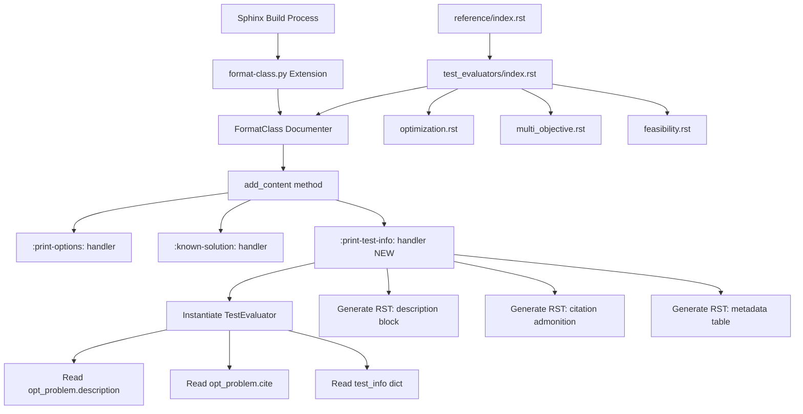
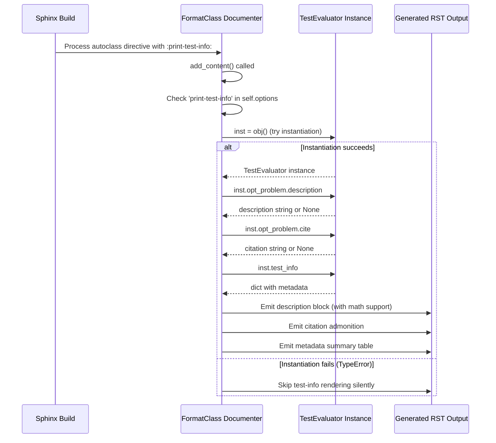

# Design Document: Test Evaluator Documentation

## Overview

This feature extends the existing `format-class` Sphinx extension to add a `:print-test-info:` directive option that renders structured metadata, mathematical descriptions, and citations for test evaluators. It also creates a new RST reference page that categorizes all 43 test evaluators by their `test_goal` (optimization, multiple_objective_optimization, feasibility) and integrates with the existing documentation structure.

The implementation touches three files: the Sphinx extension (`format-class.py`), a new RST page (`test_evaluators.rst`), and the reference index. The extension changes follow the same patterns as the existing `:known-solution:` directive — instantiating the class, reading properties, and generating RST content dynamically.

## Architecture



## Sequence Diagram



## Components and Interfaces

### Component 1: FormatClass Extension (Modified)

**Purpose**: Extends the existing Sphinx autodocumenter to support the `:print-test-info:` option for test evaluator classes.

**Interface**:
```python
class FormatClass(AutoSummClassDocumenter):
    # Existing options plus new one
    option_spec['print-test-info'] = bool_option
    
    def add_content(self, more_content: Optional[StringList]) -> None:
        """Dispatches to _print_test_info() when option is set."""
        ...
    
    def _print_test_info(self) -> None:
        """Renders test evaluator metadata as RST content."""
        ...
```

**Responsibilities**:
- Register the `:print-test-info:` option with Sphinx's autodoc system
- Instantiate the test evaluator class (handle TypeError for abstract/parameterized classes)
- Extract `opt_problem.description`, `opt_problem.cite`, and `test_info` from the instance
- Generate well-formatted RST content for each piece of metadata
- Handle None/empty values gracefully (skip sections rather than rendering empty blocks)

### Component 2: Test Evaluators RST Pages (New)

**Purpose**: Provides categorized reference pages for all 43 test evaluators, split by `test_goal` category.

**Structure**:
- `docs/source/reference/test_evaluators/index.rst` — Landing page with overview and toctree linking to category pages
- `docs/source/reference/test_evaluators/optimization.rst` — Single-objective optimization evaluators
- `docs/source/reference/test_evaluators/multi_objective.rst` — Multi-objective optimization evaluators
- `docs/source/reference/test_evaluators/feasibility.rst` — Feasibility-discovery evaluators

**Responsibilities**:
- Organize evaluators into per-category pages based on `test_info['test_goal']`
- Use `autoclass` directives with `:print-test-info:` and `:known-solution:` options
- Show inheritance via `:show-inheritance:`
- Exclude abstract base classes (MultiFiBase classes that can't be instantiated)
- Provide a landing page with a brief summary table listing evaluator counts per category

### Component 3: Reference Index (Modified)

**Purpose**: Adds the test evaluators landing page to the documentation toctree.

**Responsibilities**:
- Add `test_evaluators/index` entry to the existing toctree in `reference/index.rst`

## Data Models

### TestInfo Dictionary Structure

```python
test_info: dict = {
    "test_goal": str,           # "optimization" | "multiple_objective_optimization" | "feasibility"
    "problem_type": str,        # "continuous" | "mixed" | "discrete"
    "n_vars": int,              # Total number of variables
    "n_continuous": int,        # Number of continuous variables
    "n_discrete": int,          # Number of discrete variables
    "n_constraints": int,       # Total constraints
    "n_equality_constraints": int,
    "n_inequality_constraints": int,
    "bounded_variables": bool,  # Whether all variables have finite bounds
}
```

### OptProblem Relevant Fields

```python
class OptProblem:
    description: Optional[str]  # May contain $$ LaTeX blocks, RST :math: directives, or plain text
    cite: Optional[str]         # Academic citation string, may be None
```

## Key Functions with Formal Specifications

### Function 1: `_print_test_info(self) -> None`

```python
def _print_test_info(self) -> None:
    """Render test evaluator metadata (description, citation, test_info) as RST."""
    ...
```

**Preconditions:**
- `self.object` is a class reference (the documented class)
- `'print-test-info'` is present in `self.options`

**Postconditions:**
- If instantiation succeeds: RST lines are added for description, citation, and metadata
- If instantiation fails (TypeError): no RST lines are added for test-info (silent skip)
- If `description` is None/empty: description section is skipped
- If `cite` is None/empty: citation section is skipped
- Existing RST content (from other options) is not modified
- The `self.add_line()` method is called with valid RST syntax

**Loop Invariants:** N/A

### Function 2: `_render_description(self, description: str, source_name: str) -> None`

```python
def _render_description(self, description: str, source_name: str) -> None:
    """Render the opt_problem.description as a formatted RST block."""
    ...
```

**Preconditions:**
- `description` is a non-empty string
- `source_name` is a valid Sphinx source identifier

**Postconditions:**
- If description contains `$$...$$` LaTeX: rendered inside a `.. math::` directive
- If description is plain text: rendered as a paragraph with appropriate RST formatting
- Leading/trailing whitespace in description is stripped
- The `$$` delimiters are removed from the output (Sphinx math directive handles rendering)

**Loop Invariants:** N/A

### Function 3: `_render_citation(self, cite: str, source_name: str) -> None`

```python
def _render_citation(self, cite: str, source_name: str) -> None:
    """Render the opt_problem.cite as a styled admonition block."""
    ...
```

**Preconditions:**
- `cite` is a non-empty string
- `source_name` is a valid Sphinx source identifier

**Postconditions:**
- Citation is rendered inside a `.. admonition:: Reference` block
- Leading/trailing whitespace in citation is stripped
- Multi-line citations are properly indented for RST

**Loop Invariants:** N/A

### Function 4: `_render_test_info_table(self, test_info: dict, source_name: str) -> None`

```python
def _render_test_info_table(self, test_info: dict, source_name: str) -> None:
    """Render the test_info dictionary as an RST field list."""
    ...
```

**Preconditions:**
- `test_info` is a dict with keys: `test_goal`, `problem_type`, `n_vars`, `n_continuous`, `n_discrete`, `n_constraints`, `n_equality_constraints`, `n_inequality_constraints`, `bounded_variables`
- `source_name` is a valid Sphinx source identifier

**Postconditions:**
- All metadata fields are rendered in a consistent format (field list or table)
- Boolean values are rendered as human-readable strings ("Yes"/"No")
- Integer values are rendered as plain numbers
- `test_goal` values are rendered with underscores replaced by spaces and title-cased

**Loop Invariants:** N/A

## Algorithmic Pseudocode

### Main `_print_test_info` Algorithm

```python
def _print_test_info(self):
    source_name = self.get_sourcename()
    obj = self.object  # The class being documented

    # Attempt instantiation (same pattern as _print_known_solution)
    try:
        inst = obj()
    except TypeError:
        return  # Abstract class or requires args — skip silently

    # Render description if available
    description = inst.opt_problem.description
    if description and description.strip():
        self._render_description(description.strip(), source_name)

    # Render citation if available
    cite = inst.opt_problem.cite
    if cite and cite.strip():
        self._render_citation(cite.strip(), source_name)

    # Render test_info metadata (always available for valid instances)
    test_info = inst.test_info
    self._render_test_info_table(test_info, source_name)
```

### Description Rendering Algorithm

```python
def _render_description(self, description, source_name):
    self.add_line('|', source_name)
    self.add_line('', source_name)
    self.add_line('.. rst-class:: title', source_name)
    self.add_line('', source_name)
    self.add_line('**Problem Description**', source_name)
    self.add_line('', source_name)

    # Check if content is wrapped in $$ delimiters (LaTeX math block)
    if description.startswith('$$') and description.endswith('$$'):
        # Strip $$ and render as math directive
        math_content = description[2:-2].strip()
        self.add_line('.. math::', source_name)
        self.add_line('', source_name)
        # Don't use math directive for multi-line text descriptions
        # Instead render as a block with inline math preserved
        for line in math_content.split('\n'):
            self.add_line('   ' + line, source_name)
    else:
        # Plain text description — render as paragraph
        for line in description.split('\n'):
            self.add_line(line, source_name)

    self.add_line('', source_name)
```

### Citation Rendering Algorithm

```python
def _render_citation(self, cite, source_name):
    self.add_line('.. admonition:: Reference', source_name)
    self.add_line('', source_name)
    for line in cite.split('\n'):
        self.add_line('   ' + line.strip(), source_name)
    self.add_line('', source_name)
```

### Metadata Table Rendering Algorithm

```python
def _render_test_info_table(self, test_info, source_name):
    self.add_line('.. rst-class:: title', source_name)
    self.add_line('', source_name)
    self.add_line('**Problem Metadata**', source_name)
    self.add_line('', source_name)

    # Render as field list for clean appearance
    labels = {
        'test_goal': 'Test Goal',
        'problem_type': 'Problem Type',
        'n_vars': 'Variables',
        'n_continuous': 'Continuous Variables',
        'n_discrete': 'Discrete Variables',
        'n_constraints': 'Constraints',
        'n_equality_constraints': 'Equality Constraints',
        'n_inequality_constraints': 'Inequality Constraints',
        'bounded_variables': 'Bounded Variables',
    }

    for key, label in labels.items():
        value = test_info[key]
        if isinstance(value, bool):
            display_value = 'Yes' if value else 'No'
        elif key in ('test_goal', 'problem_type'):
            display_value = str(value).replace('_', ' ').title()
        else:
            display_value = str(value)
        self.add_line(f':{label}: {display_value}', source_name)

    self.add_line('', source_name)
    self.add_line('|', source_name)
    self.add_line('', source_name)
```

## Example Usage

```python
# In an RST file, using the new directive option:
#
# .. autoclass:: standard_evaluator.evaluators.test.Sphere
#     :print-test-info:
#     :known-solution:
#     :show-inheritance:
#
# This will render:
# 1. The class docstring
# 2. Problem Description (math or text block)
# 3. Reference citation (admonition)
# 4. Problem Metadata (field list)
# 5. Known Solution table (from existing directive)
# 6. Method/attribute summary (from autodocsumm)
```

## Correctness Properties

*A property is a characteristic or behavior that should hold true across all valid executions of a system — essentially, a formal statement about what the system should do. Properties serve as the bridge between human-readable specifications and machine-verifiable correctness guarantees.*

### Property 1: Graceful instantiation failure handling

For any test evaluator class that raises TypeError on instantiation (e.g., abstract base classes or classes requiring constructor arguments), the `:print-test-info:` directive SHALL produce no test-info RST output and SHALL NOT raise an exception.

**Validates: Requirements TBD**

### Property 2: None/empty field skipping

For any test evaluator where `opt_problem.description` is None or empty, the rendered RST SHALL NOT contain a "Problem Description" section. Similarly for `opt_problem.cite` and the "Reference" admonition.

**Validates: Requirements TBD**

### Property 3: LaTeX content preservation

For any test evaluator whose `opt_problem.description` contains `$$...$$` delimited content, the rendered RST SHALL contain a `.. math::` directive with the LaTeX content (minus the `$$` delimiters) properly indented.

**Validates: Requirements TBD**

### Property 4: Complete metadata rendering

For any successfully instantiated test evaluator, the rendered RST SHALL contain field entries for all 9 keys in the `test_info` dictionary (test_goal, problem_type, n_vars, n_continuous, n_discrete, n_constraints, n_equality_constraints, n_inequality_constraints, bounded_variables).

**Validates: Requirements TBD**

### Property 5: Existing directive compatibility

For any class documented with `:print-options:` and/or `:known-solution:` options alongside `:print-test-info:`, all three directives SHALL produce their respective output without interference.

**Validates: Requirements TBD**

## Error Handling

### Error Scenario 1: Abstract class instantiation

**Condition**: The documented class is abstract (e.g., `BoreholeMultiFiBase`) or requires constructor arguments that aren't provided
**Response**: `TypeError` is caught silently; no test-info content is rendered
**Recovery**: The rest of the documentation (docstring, method summary) continues normally

### Error Scenario 2: Missing opt_problem attribute

**Condition**: The class doesn't have an `opt_problem` attribute (unlikely for TestEvaluator subclasses but defensive)
**Response**: Check with `hasattr()` before accessing; skip if missing
**Recovery**: Normal documentation flow continues

### Error Scenario 3: Malformed description content

**Condition**: Description starts with `$$` but doesn't end with `$$`, or contains invalid RST
**Response**: Treat as plain text (fall through to non-math rendering path)
**Recovery**: Content is rendered as-is; any RST issues surface as Sphinx build warnings (not errors)

## Testing Strategy

### Unit Testing Approach

- Test `_print_test_info` with mock evaluator classes that have various combinations of description/cite/test_info
- Test with None description, None cite, empty strings
- Test with `$$` wrapped LaTeX content vs. plain text
- Verify the RST output structure by checking add_line calls

### Property-Based Testing Approach

Property-based testing is not strongly applicable here — this is primarily a Sphinx extension rendering feature where the outputs are RST strings. The meaningful validation is that the Sphinx build succeeds without errors for all 43 evaluators.

### Integration Testing Approach

- Run `sphinx-build` on the documentation and verify:
  - No build errors or warnings from the test_evaluators page
  - All 43 evaluators (minus abstract bases) render successfully
  - The new page appears in the toctree
  - LaTeX math renders correctly (manual verification)

## Performance Considerations

Each test evaluator is instantiated during the Sphinx build to extract metadata. For evaluators with expensive constructors (unlikely for test functions), this adds build time. The 43 evaluators should instantiate quickly since they're lightweight mathematical functions.

## Security Considerations

Not applicable — this is documentation tooling with no user-facing inputs or network access.

## Dependencies

- `sphinx` (existing)
- `autodocsumm` (existing)
- `sphinx.ext.mathjax` (existing — for LaTeX rendering)
- No new dependencies required
